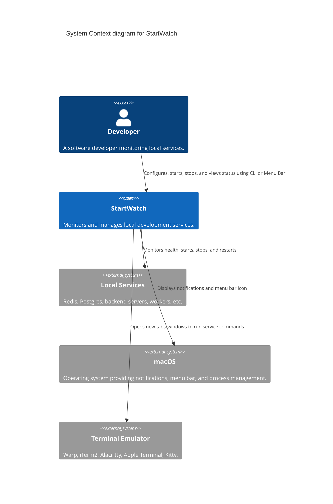
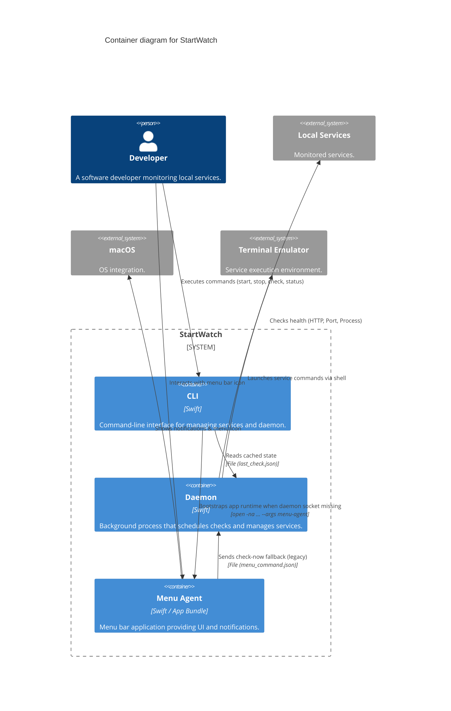
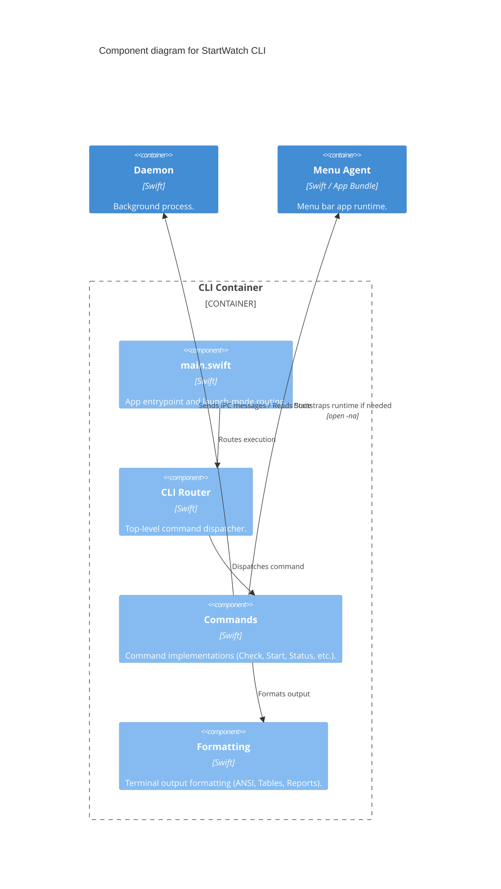
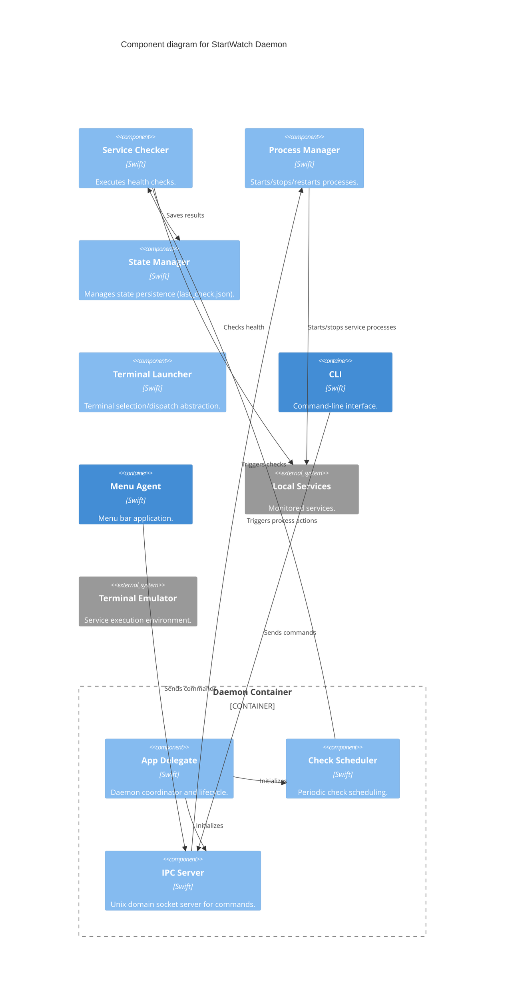
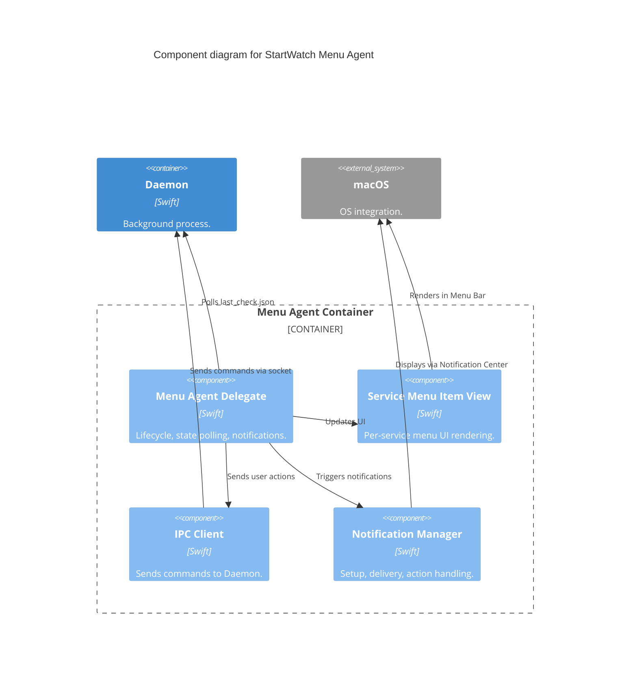

# StartWatch Architecture

## System Context (Level 1)

## Container (Level 2)

## Component (Level 3)

### CLI Components

### Daemon Components

### Menu Agent Components

## Data Flow & IPC

StartWatch uses a hybrid IPC architecture:

1. **Real-time Command Channel (Unix Domain Socket)**
   - **Path**: `~/.local/state/startwatch/sock`
   - **Direction**: CLI/Menu → Daemon (one-way commands)
   - **Messages**: `triggerCheck`, `startService`, `stopService`, `restartService`, `quit`
   - **Auto-bootstrap**: if socket is missing, CLI first runs `open -na <StartWatchMenu.app> --args menu-agent`, then retries IPC.

2. **State Synchronization Channel (File-based Polling)**
   - **File**: `~/.local/state/startwatch/last_check.json`
   - **Direction**: Daemon → Menu/CLI
   - **Mechanism**: Daemon writes check results; Menu Agent polls every 3s (0.5s when starting); CLI reads on-demand for `status`.
   - **Note**: `menu_command.json` is only a fallback path for `check_now`; primary Menu → Daemon control path is Unix socket IPC.

## Runtime Ownership Rules

- LaunchAgent starts only `startwatch daemon --no-menu`.
- `.app` launch starts `menu-agent` and ensures daemon readiness.
- CLI acts as a client to app-owned runtime; it does not own long-lived UI lifecycle.
