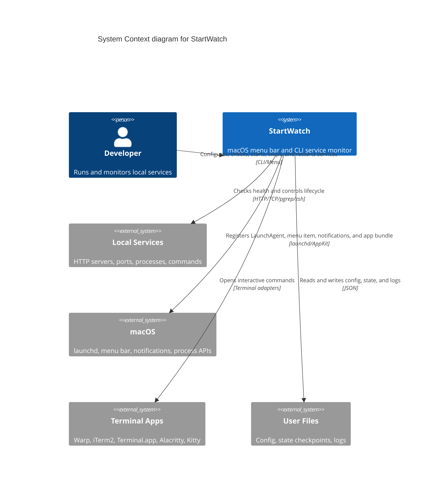
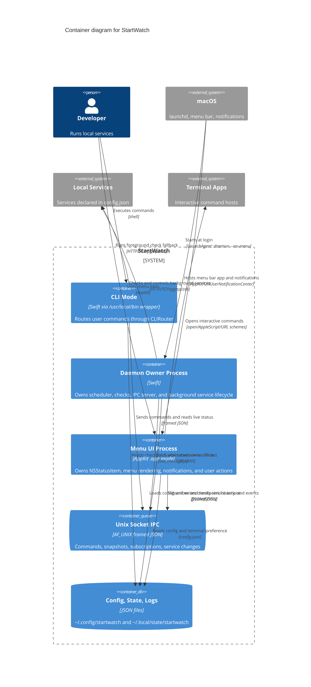
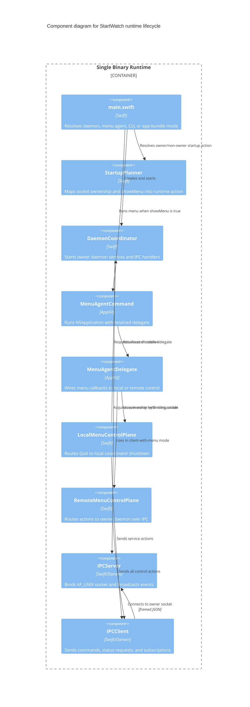
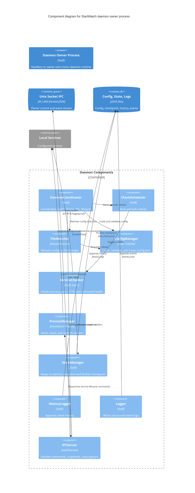
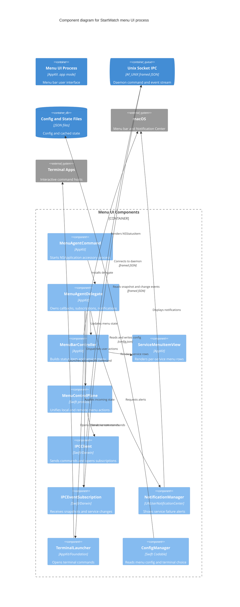
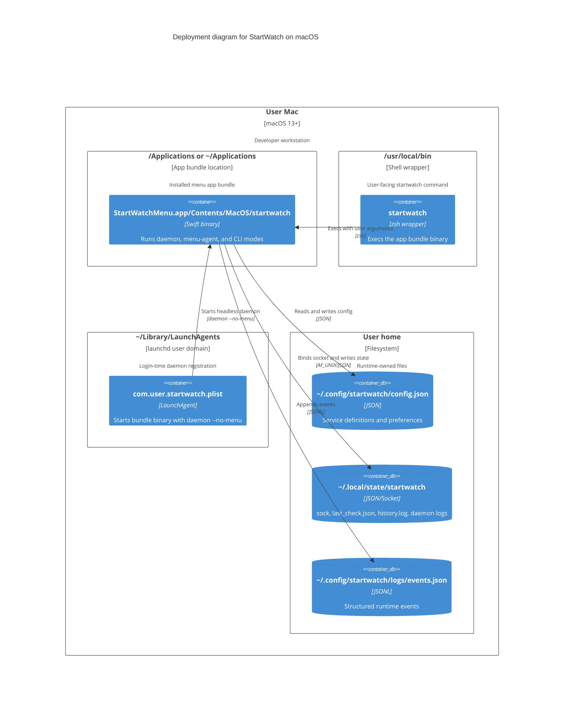
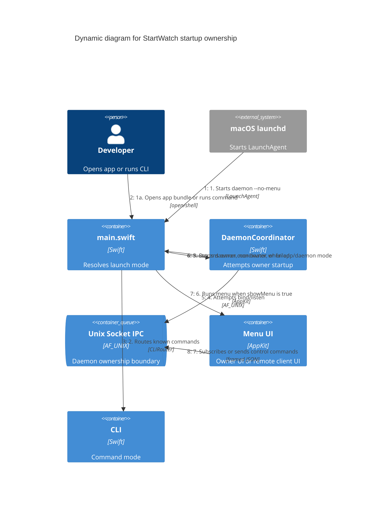

# StartWatch Architecture

This document reflects the current code and installer layout: a single Swift
binary runs as CLI, daemon owner, or menu UI depending on launch arguments and
socket ownership.

## System Context (Level 1)

```mermaid
C4Context
    title System Context diagram for StartWatch

    Person(developer, "Developer", "Runs and monitors local services")
    System(startwatch, "StartWatch", "macOS menu bar and CLI service monitor")

    System_Ext(localServices, "Local Services", "HTTP servers, ports, processes, commands")
    System_Ext(macos, "macOS", "launchd, menu bar, notifications, process APIs")
    System_Ext(terminals, "Terminal Apps", "Warp, iTerm2, Terminal.app, Alacritty, Kitty")
    System_Ext(userFiles, "User Files", "Config, state checkpoints, logs")

    Rel(developer, startwatch, "Configures, checks, starts, stops, and restarts services", "CLI/Menu")
    Rel(startwatch, localServices, "Checks health and controls lifecycle", "HTTP/TCP/pgrep/zsh")
    Rel(startwatch, macos, "Registers LaunchAgent, menu item, notifications, and app bundle", "launchd/AppKit")
    Rel(startwatch, terminals, "Opens interactive commands", "Terminal adapters")
    Rel(startwatch, userFiles, "Reads and writes config, state, and logs", "JSON")
```

## Containers (Level 2)

```mermaid
C4Container
    title Container diagram for StartWatch

    Person(developer, "Developer", "Runs local services")
    System_Ext(macos, "macOS", "launchd, menu bar, notifications")
    System_Ext(localServices, "Local Services", "Services declared in config.json")
    System_Ext(terminals, "Terminal Apps", "Interactive command hosts")

    System_Boundary(startwatchSystem, "StartWatch") {
        Container(cli, "CLI Mode", "Swift via /usr/local/bin wrapper", "Routes user commands through CLIRouter")
        Container(daemon, "Daemon Owner Process", "Swift", "Owns scheduler, checks, IPC server, and background service lifecycle")
        Container(menu, "Menu UI Process", "AppKit .app mode", "Owns NSStatusItem, menu rendering, notifications, and user actions")
        ContainerQueue(socket, "Unix Socket IPC", "AF_UNIX framed JSON", "Commands, snapshots, subscriptions, service changes")
        ContainerDb(files, "Config, State, Logs", "JSON files", "~/.config/startwatch and ~/.local/state/startwatch")
    }

    Rel(developer, cli, "Executes commands", "shell")
    Rel(developer, menu, "Uses menu item", "AppKit")

    Rel(macos, daemon, "Starts at login", "LaunchAgent: daemon --no-menu")
    Rel(macos, menu, "Hosts menu bar app and notifications", "AppKit/UNUserNotificationCenter")

    Rel(cli, socket, "Sends commands and reads live status", "framed JSON")
    Rel(cli, files, "Reads checkpoint when daemon is offline", "last_check.json")
    Rel(cli, localServices, "Runs foreground check fallback", "HTTP/TCP/pgrep/zsh")

    Rel(menu, socket, "Subscribes and sends service actions", "framed JSON")
    Rel(menu, files, "Reads config and terminal preference", "config.json")
    Rel(menu, terminals, "Opens interactive commands", "open/AppleScript/URL schemes")

    Rel(daemon, socket, "Binds and serves owner socket", "AF_UNIX")
    Rel(daemon, files, "Loads config and writes checkpoint, history, and events", "JSON/JSONL")
    Rel(daemon, localServices, "Checks and controls background services", "HTTP/TCP/pgrep/zsh")
```

## Runtime Lifecycle Components (Level 3)

```mermaid
C4Component
    title Component diagram for StartWatch runtime lifecycle

    Container_Boundary(runtime, "Single Binary Runtime") {
        Component(entrypoint, "main.swift", "Swift", "Resolves daemon, menu-agent, CLI, or app-bundle mode")
        Component(planner, "StartupPlanner", "Swift", "Maps socket ownership and showMenu into runtime action")
        Component(coordinator, "DaemonCoordinator", "Swift", "Starts owner daemon services and IPC handlers")
        Component(menuCommand, "MenuAgentCommand", "AppKit", "Runs NSApplication with retained delegate")
        Component(menuDelegate, "MenuAgentDelegate", "AppKit", "Wires menu callbacks to local or remote control")
        Component(localControl, "LocalMenuControlPlane", "Swift", "Routes Quit to local coordinator shutdown")
        Component(remoteControl, "RemoteMenuControlPlane", "Swift", "Routes actions to owner daemon over IPC")
        Component(ipcServer, "IPCServer", "Swift/Darwin", "Binds AF_UNIX socket and broadcasts events")
        Component(ipcClient, "IPCClient", "Swift/Darwin", "Sends commands, status requests, and subscriptions")
    }

    Rel(entrypoint, coordinator, "Creates and starts")
    Rel(coordinator, ipcServer, "Acquires ownership by binding socket")
    Rel(entrypoint, planner, "Resolves owner/non-owner startup action")
    Rel(entrypoint, menuCommand, "Runs menu when showMenu is true")
    Rel(menuCommand, menuDelegate, "Retains and installs delegate")
    Rel(menuDelegate, localControl, "Uses in owner-with-menu mode")
    Rel(menuDelegate, remoteControl, "Uses in client-with-menu mode")
    Rel(localControl, coordinator, "Requests direct shutdown")
    Rel(localControl, ipcClient, "Sends service actions")
    Rel(remoteControl, ipcClient, "Sends all control actions")
    Rel(ipcClient, ipcServer, "Connects to owner socket", "framed JSON")
```

## Daemon Components (Level 3)

```mermaid
C4Component
    title Component diagram for StartWatch daemon owner process

    Container(daemon, "Daemon Owner Process", "Swift", "Headless or owner-with-menu daemon runtime")
    ContainerQueue(socket, "Unix Socket IPC", "AF_UNIX framed JSON", "Owner control and event stream")
    ContainerDb(files, "Config, State, Logs", "JSON files", "Config, checkpoint, history, events")
    System_Ext(localServices, "Local Services", "Configured services")

    Container_Boundary(daemonBoundary, "Daemon Components") {
        Component(coordinator, "DaemonCoordinator", "Swift", "Coordinates config, checks, IPC, lifecycle")
        Component(scheduler, "CheckScheduler", "Swift", "Runs periodic checks")
        Component(fileWatcher, "FileWatcher", "DispatchSource", "Reloads config on file changes")
        Component(configManager, "ConfigManager", "Swift Codable", "Loads, validates, and saves config.json")
        Component(serviceChecker, "ServiceChecker", "Swift async", "Checks process, port, HTTP, and command health")
        Component(processManager, "ProcessManager", "Foundation Process", "Starts, stops, and restarts services")
        Component(stateManager, "StateManager", "Swift", "Keeps in-memory snapshot and flushes checkpoint")
        Component(historyLogger, "HistoryLogger", "Swift", "Appends check history")
        Component(logger, "Logger", "Swift", "Writes structured event logs")
        Component(ipcServer, "IPCServer", "Swift/Darwin", "Handles commands, snapshots, subscriptions")
    }

    Rel(coordinator, ipcServer, "Configures command handlers")
    Rel(coordinator, scheduler, "Starts periodic checks")
    Rel(coordinator, fileWatcher, "Watches config directory")
    Rel(coordinator, configManager, "Loads and validates config")
    Rel(scheduler, serviceChecker, "Triggers checks")
    Rel(fileWatcher, configManager, "Requests reload")
    Rel(serviceChecker, localServices, "Checks health", "HTTP/TCP/pgrep/zsh")
    Rel(ipcServer, processManager, "Dispatches service lifecycle commands")
    Rel(processManager, localServices, "Controls background/external processes", "zsh/pkill/lsof")
    Rel(serviceChecker, stateManager, "Updates snapshot")
    Rel(stateManager, files, "Flushes checkpoint", "last_check.json")
    Rel(historyLogger, files, "Appends history", "history.log")
    Rel(logger, files, "Appends events", "events.json")
    Rel(ipcServer, socket, "Listens and broadcasts", "AF_UNIX")
```

## Menu UI Components (Level 3)

```mermaid
C4Component
    title Component diagram for StartWatch menu UI process

    Container(menu, "Menu UI Process", "AppKit .app mode", "Menu bar user interface")
    ContainerQueue(socket, "Unix Socket IPC", "AF_UNIX framed JSON", "Daemon command and event stream")
    ContainerDb(files, "Config and State Files", "JSON files", "Config and cached state")
    System_Ext(macos, "macOS", "Menu bar and Notification Center")
    System_Ext(terminals, "Terminal Apps", "Interactive command hosts")

    Container_Boundary(menuBoundary, "Menu UI Components") {
        Component(menuCommand, "MenuAgentCommand", "AppKit", "Starts NSApplication accessory process")
        Component(delegate, "MenuAgentDelegate", "AppKit", "Owns callbacks, subscriptions, notifications")
        Component(menuBar, "MenuBarController", "AppKit", "Builds status item and service menu")
        Component(itemView, "ServiceMenuItemView", "AppKit", "Renders per-service menu rows")
        Component(controlPlane, "MenuControlPlane", "Swift protocol", "Unifies local and remote menu actions")
        Component(ipcClient, "IPCClient", "Swift/Darwin", "Sends commands and opens subscriptions")
        Component(subscription, "IPCEventSubscription", "Swift/Darwin", "Receives snapshots and service changes")
        Component(notifications, "NotificationManager", "UNUserNotificationCenter", "Shows service failure alerts")
        Component(terminalLauncher, "TerminalLauncher", "AppKit/Foundation", "Opens terminal commands")
        Component(configManager, "ConfigManager", "Swift Codable", "Reads menu config and terminal choice")
    }

    Rel(menuCommand, delegate, "Installs delegate")
    Rel(delegate, menuBar, "Updates menu state")
    Rel(menuBar, itemView, "Renders service rows")
    Rel(delegate, controlPlane, "Dispatches user actions")
    Rel(controlPlane, ipcClient, "Sends remote commands")
    Rel(ipcClient, socket, "Connects to daemon", "framed JSON")
    Rel(subscription, socket, "Reads snapshot and change events", "framed JSON")
    Rel(delegate, subscription, "Applies incoming state")
    Rel(delegate, notifications, "Requests alerts")
    Rel(notifications, macos, "Displays notifications")
    Rel(menuBar, macos, "Renders NSStatusItem")
    Rel(delegate, terminalLauncher, "Opens interactive commands")
    Rel(terminalLauncher, terminals, "Launches app-specific command")
    Rel(configManager, files, "Reads and writes config", "config.json")
```

## Deployment (Level 4)

```mermaid
C4Deployment
    title Deployment diagram for StartWatch on macOS

    Deployment_Node(userMac, "User Mac", "macOS 13+", "Developer workstation") {
        Deployment_Node(applications, "/Applications or ~/Applications", "App bundle location", "Installed menu app bundle") {
            Container(bundleBinary, "StartWatchMenu.app/Contents/MacOS/startwatch", "Swift binary", "Runs daemon, menu-agent, and CLI modes")
        }

        Deployment_Node(pathBin, "/usr/local/bin", "Shell wrapper", "User-facing startwatch command") {
            Container(cliWrapper, "startwatch", "zsh wrapper", "Execs the app bundle binary")
        }

        Deployment_Node(launchAgents, "~/Library/LaunchAgents", "launchd user domain", "Login-time daemon registration") {
            Container(launchAgent, "com.user.startwatch.plist", "LaunchAgent", "Starts bundle binary with daemon --no-menu")
        }

        Deployment_Node(homeConfig, "User home", "Filesystem", "Runtime-owned files") {
            ContainerDb(configFile, "~/.config/startwatch/config.json", "JSON", "Service definitions and preferences")
            ContainerDb(stateFiles, "~/.local/state/startwatch", "JSON/Socket", "sock, last_check.json, history.log, daemon logs")
            ContainerDb(eventLog, "~/.config/startwatch/logs/events.json", "JSONL", "Structured runtime events")
        }
    }

    Rel(cliWrapper, bundleBinary, "Execs with user arguments", "zsh")
    Rel(launchAgent, bundleBinary, "Starts headless daemon", "daemon --no-menu")
    Rel(bundleBinary, configFile, "Reads and writes config", "JSON")
    Rel(bundleBinary, stateFiles, "Binds socket and writes state", "AF_UNIX/JSON")
    Rel(bundleBinary, eventLog, "Appends events", "JSONL")
```

## Dynamic Flow: Startup Ownership

```mermaid
C4Dynamic
    title Dynamic diagram for StartWatch startup ownership

    Person(developer, "Developer", "Opens app or runs CLI")
    System_Ext(macos, "macOS launchd", "Starts LaunchAgent")
    Container(entrypoint, "main.swift", "Swift", "Resolves launch mode")
    Container(coordinator, "DaemonCoordinator", "Swift", "Attempts owner startup")
    ContainerQueue(socket, "Unix Socket IPC", "AF_UNIX", "Daemon ownership boundary")
    Container(menu, "Menu UI", "AppKit", "Owner UI or remote client UI")
    Container(cli, "CLI", "Swift", "Command mode")

    Rel(macos, entrypoint, "1. Starts daemon --no-menu", "LaunchAgent")
    Rel(developer, entrypoint, "1a. Opens app bundle or runs command", "open/shell")
    Rel(entrypoint, cli, "2. Routes known commands", "CLIRouter")
    Rel(entrypoint, coordinator, "3. Starts daemon coordinator when app/daemon mode")
    Rel(coordinator, socket, "4. Attempts bind/listen", "AF_UNIX")
    Rel(coordinator, entrypoint, "5. Returns owner, non-owner, or failed")
    Rel(entrypoint, menu, "6. Runs menu when showMenu is true", "AppKit")
    Rel(menu, socket, "7. Subscribes or sends control commands", "framed JSON")
```

## Runtime Rules

- `daemon --no-menu` starts a headless owner only when the Unix socket bind
  succeeds. If an owner daemon is reachable, the duplicate headless process exits.
- App bundle launch and `menu-agent` run with `showMenu=true`. If the process owns
  the socket, menu control can shut down the local coordinator; if another daemon
  owns the socket, the menu runs as a remote client over IPC.
- The canonical LaunchAgent is `com.user.startwatch`; installer writes it to start
  the bundle binary with `daemon --no-menu`.
- `/usr/local/bin/startwatch` is a wrapper that execs the app bundle binary, so CLI
  and LaunchAgent use the same installed binary.
- Primary control and state propagation use the Unix socket: `trigger_check`,
  `get_status`, `subscribe`, `start_service`, `stop_service`, `restart_service`,
  and `quit`.
- `last_check.json` is a checkpoint/fallback, not the primary menu update channel.
  The daemon keeps state in memory and flushes it periodically or on shutdown.
- `startwatch status` prefers live `get_status`, then checkpoint fallback, then a
  foreground check if no daemon state exists. `startwatch check` may request a
  daemon check, but still prints its own foreground check result.
