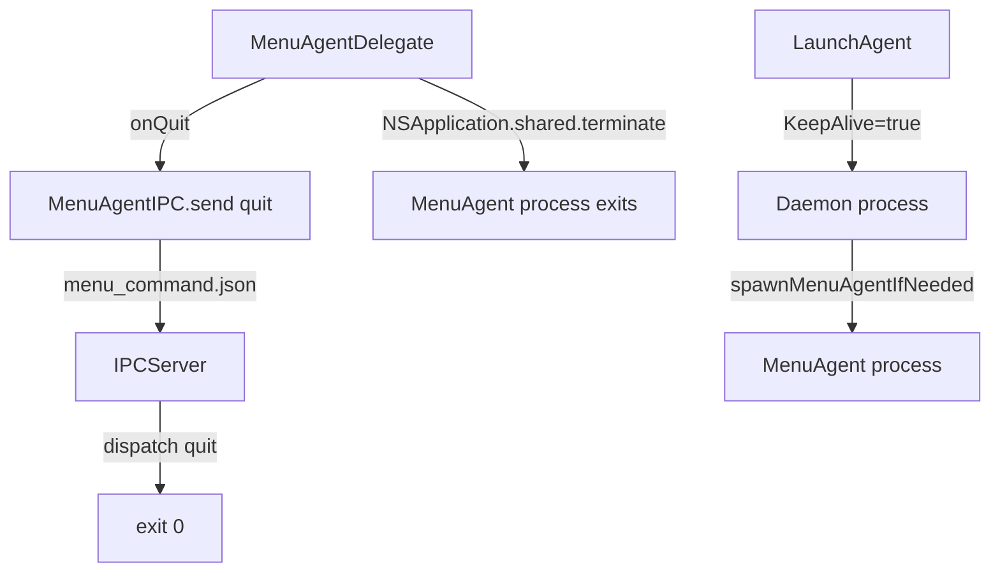

# Диагностика проблемы: Quit не завершает процессы

## Проблема
При нажатии "Выйти" в меню:
- Иконка исчезает из menu bar
- Процессы StartWatch продолжают работать (видно через `ps aux`)
- Ожидается: все процессы должны завершиться

## Текущая архитектура



## Обнаруженные проблемы

### 1. LaunchAgent KeepAlive
В [`com.user.startwatch.plist`](com.user.startwatch.plist:17-18):
```xml
<key>KeepAlive</key>
<true/>
```

**Проблема:** LaunchAgent автоматически перезапускает daemon процесс после его завершения.

**Решение:** Убрать `KeepAlive` или добавить условие `SuccessfulExit`:
```xml
<key>KeepAlive</key>
<dict>
    <key>SuccessfulExit</key>
    <false/>
</dict>
```

### 2. IPC коммуникация
MenuAgent отправляет `quit` через файл `menu_command.json`, но daemon использует Unix socket IPC.

**Проблема:** [`MenuAgentIPC.send()`](Sources/StartWatch/MenuAgent/MenuAgentDelegate.swift:100-106) пишет в файл, а [`IPCServer`](Sources/StartWatch/IPC/IPCServer.swift) слушает Unix socket.

**Решение:** Использовать [`IPCClient.send()`](Sources/StartWatch/MenuAgent/MenuAgentDelegate.swift:36-38) для отправки quit команды.

### 3. Отсутствует graceful shutdown
Daemon не останавливает запущенные сервисы перед завершением.

**Решение:** Добавить cleanup в DaemonCoordinator перед exit.

## План исправления

1. **Исправить IPC коммуникацию**
   - Заменить `MenuAgentIPC.send(action: "quit")` на `IPCClient.send(.quit)`
   - Добавить `quit` кейс в `IPCMessage`

2. **Добавить graceful shutdown**
   - В DaemonCoordinator добавить метод `shutdown()`
   - Остановить все запущенные сервисы через ProcessManager
   - Остановить scheduler, fileWatcher, IPCServer

3. **Исправить LaunchAgent**
   - Убрать `KeepAlive` или настроить условия перезапуска
   - Добавить логирование при завершении

4. **Добавить логирование**
   - Логировать получение quit команды
   - Логировать завершение процессов
   - Логировать перезапуск через LaunchAgent

## Тестирование

1. Собрать и установить: `swift build && sudo ./install.sh`
2. Запустить daemon: `startwatch daemon &`
3. Проверить процессы: `ps aux | grep startwatch`
4. Нажать "Выйти" в меню
5. Проверить процессы снова: `ps aux | grep startwatch`
6. Проверить логи: `cat /Users/Shared/startwatch.log`
