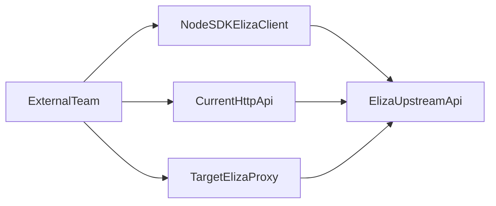

# Eliza Client Integration Guide

Этот документ для внешних команд, которым нужно интегрироваться с Eliza в контексте текущего `groovy_agent`.

## Статус интерфейсов

- **As-is (реализовано сейчас):**
  - Node SDK через `eliza-client` из `lib/eliza-client`
  - HTTP API `groovy_agent`: `/api/models`, `/api/models/test`, `/api/chat`
- **To-be (целевая архитектура):**
  - отдельный `eliza-proxy` с `/v1/*` (описан в `docs/eliza-proxy-architecture-plan.md`)
  - это **план**, а не реализованный контракт в данном репозитории

## Быстрый выбор интеграции

- Нужна интеграция в Node.js процесс: используйте **SDK (`createElizaClient`)**
- Нужна интеграция по HTTP с текущим сервисом: используйте **`/api/*`**
- Нужен стабильный межкомандный API на будущее: ориентируйтесь на **`eliza-proxy /v1/*`** и миграционный раздел ниже

## Вариант 1 (as-is): Node SDK `eliza-client`

Источник: `lib/eliza-client/index.js`

### Публичный API

- `createElizaClient({ token, baseUrl? })`
- `getModels()` -> `{ models, validated, onValidated(cb) }`
- `chat(model, messages, { system? })` -> async generator чанков
- `chatOnce(model, messages, { system? })` -> `{ content }`
- `probe(model)` -> `boolean`

### Минимальный пример

```js
const { createElizaClient } = require('./lib/eliza-client');

async function main() {
  const eliza = createElizaClient({ token: process.env.ELIZA_TOKEN });

  const modelState = await eliza.getModels();
  console.log('validated now:', modelState.validated);
  modelState.onValidated((models) => {
    console.log('validated models:', models.length);
  });

  const model = modelState.models[0]?.id || 'gpt-4.1';
  const response = await eliza.chatOnce(model, [{ role: 'user', content: 'Привет!' }], {
    system: 'Ты полезный ассистент.',
  });
  console.log(response.content);
}

main().catch(console.error);
```

### Streaming пример

```js
for await (const chunk of eliza.chat('claude-sonnet-4-6', [{ role: 'user', content: 'Сделай кратко' }])) {
  if (chunk.error) {
    console.error('stream error:', chunk.error);
    break;
  }
  if (chunk.done) {
    console.log('\n[DONE]');
    break;
  }
  process.stdout.write(chunk.delta || '');
}
```

### Важные ограничения

- Для GPT-5 стриминг не поддержан в текущем клиенте -> ошибка `501` (`ElizaError`)
- Авторизация только `Authorization: OAuth <ELIZA_TOKEN>`
- `getModels()` сначала может вернуть сырые модели (`validated: false`), затем фоновой `probe` отдаст валидированный набор через `onValidated`

## Вариант 2 (as-is): HTTP API текущего `groovy_agent`

Источник: `server.js`

### `GET /api/models`

Возвращает кэш моделей из `models.json`.

- Если валидация завершена:
  - `{ models: [...], validated: true, ... }`
- Если фоновая валидация еще идет:
  - `{ models: [], pending: true, error: "...еще не проверен..." }`

### `POST /api/models/test`

Проверяет доступность конкретной модели.

Request:

```json
{ "model": "gpt-4.1" }
```

Response:

```json
{ "available": true, "latency": 1240, "variant": "openai-string-max_tokens" }
```

### `POST /api/chat` (SSE)

Request (минимум):

```json
{
  "model": "claude-sonnet-4-6",
  "messages": [{ "role": "user", "content": "Привет" }]
}
```

SSE ответ нормализуется к формату:

```text
data: {"text":"..."}\n\n
data: [DONE]\n\n
data: {"error":"..."}\n\n
```

`curl` пример:

```bash
curl -N -X POST http://localhost:3000/api/chat \
  -H "Content-Type: application/json" \
  -d '{
    "model": "gpt-4.1",
    "messages": [{"role":"user","content":"Скажи кратко привет"}]
  }'
```

## Вариант 3 (to-be): `eliza-proxy` API `/v1/*`

Источник: `docs/eliza-proxy-architecture-plan.md`

Планируемые точки:

- `GET /v1/health`
- `GET /v1/models`
- `POST /v1/chat` (SSE)
- `POST /v1/probe`
- `GET /v1/usage`

Пример (из плана):

```bash
curl -N -X POST http://localhost:3100/v1/chat \
  -H "Content-Type: application/json" \
  -d '{
    "model": "claude-sonnet-4-6",
    "messages": [{"role":"user","content":"Привет"}],
    "system": "Ты полезный ассистент."
  }'
```

Важно: не считайте `/v1/*` рабочим контрактом этого репозитория, пока `eliza-proxy` не выделен и не развернут.

## SSE контракт (для интегратора)

В текущем runtime используйте один парсер событий с тремя случаями:

- `data: {"text":"..."}`
  - добавляйте в буфер ответа
- `data: {"error":"..."}`
  - завершайте стрим как ошибку
- `data: [DONE]`
  - завершайте стрим как успех

Рекомендация: обрабатывайте стрим построчно (не предполагая, что каждое чтение сокета содержит полное событие).

## Переменные окружения

### Текущий `groovy_agent` / SDK

- `ELIZA_TOKEN` (обязательно)
- `PORT` (по умолчанию `3000` для `groovy_agent`)

### Целевой `eliza-proxy` (по плану)

- `ELIZA_TOKEN` (обязательно)
- `PORT` (по умолчанию `3100`)
- `LOG_USAGE` (default `true`)
- `USAGE_LOG_FILE` (default `./usage.jsonl`)
- Для клиентов `groovy_agent` в плане предусмотрен `ELIZA_PROXY_URL` и fallback

## Текущий vs Целевой API

| Назначение | As-is | To-be |
|---|---|---|
| Health | нет выделенного API health | `GET /v1/health` |
| Список моделей | `GET /api/models` | `GET /v1/models` |
| Probe модели | `POST /api/models/test` | `POST /v1/probe` |
| Чат (SSE) | `POST /api/chat` | `POST /v1/chat` |
| Usage статистика | нет отдельного endpoint | `GET /v1/usage` |

## Рекомендованный путь миграции

1. **Сейчас:** интегрируйтесь через `eliza-client` (Node) или `/api/*` (HTTP), если нужен рабочий контракт без ожидания.
2. **Подготовка:** отделите в клиенте транспортный слой (base URL, endpoint mapping, SSE parser).
3. **Переход:** после появления `eliza-proxy`, переключите base URL + endpoint map на `/v1/*`.
4. **Проверка:** прогоните smoke-тесты на одинаковых сценариях (`models`, `chat`, `probe`) и сверку обработки ошибок.

## Схема потоков



## Источники истины

- `lib/eliza-client/index.js`
- `server.js`
- `docs/eliza-proxy-architecture-plan.md`
- `docs/superpowers/specs/2026-04-19-eliza-client-design.md`
