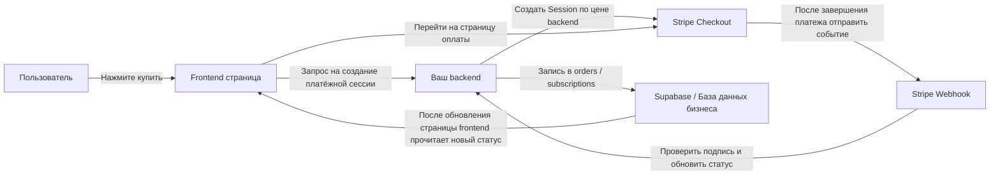
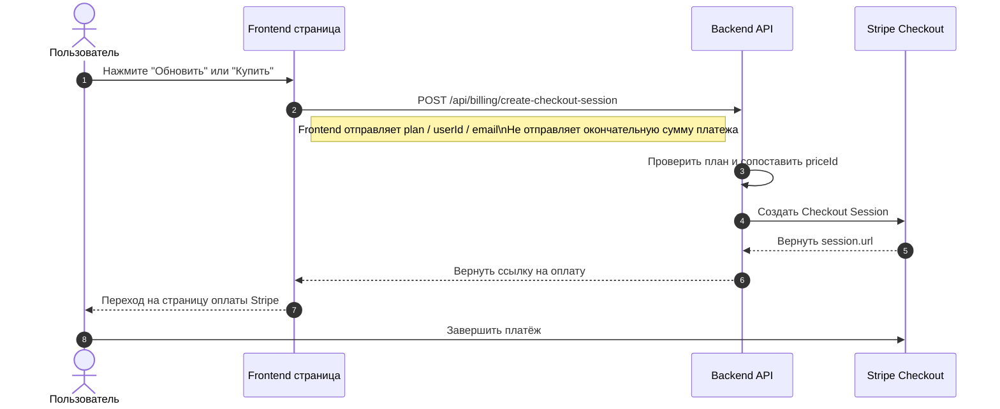
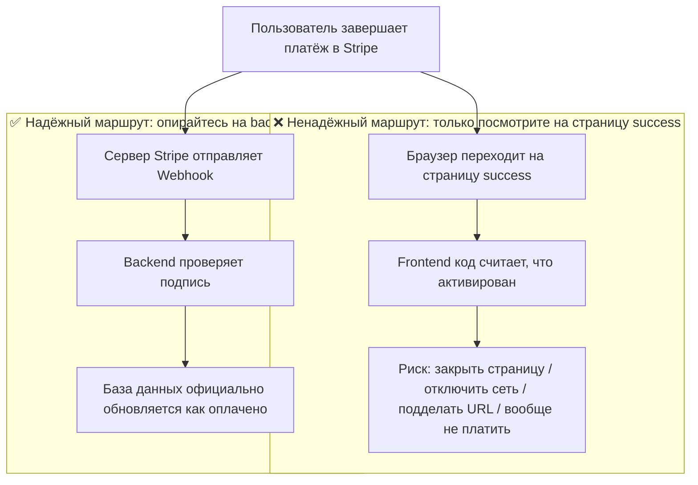
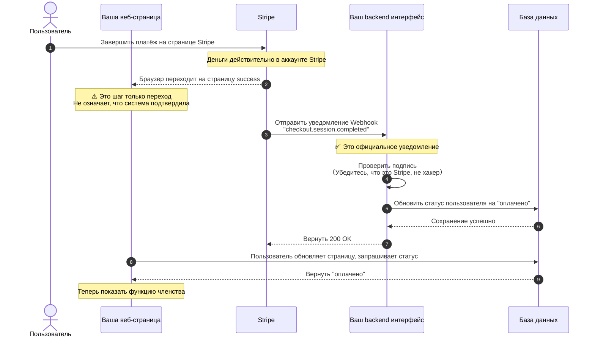
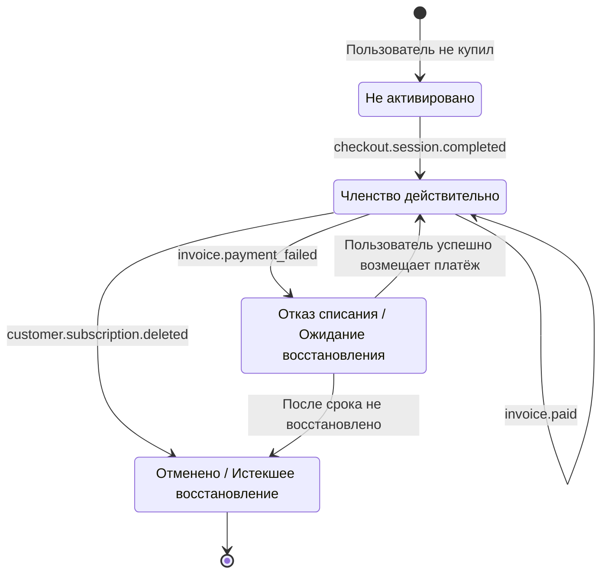
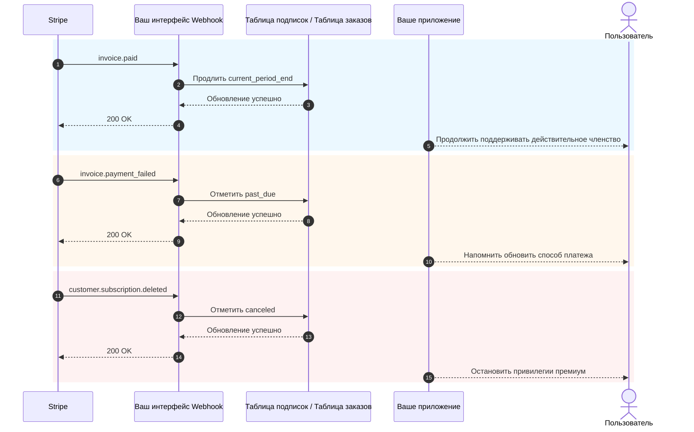

<!-- nav -->
**📚 Версии:** [Кратко](../../../lesson-summaries/stage-2/backend/stripe-payment.md) · [Расширенно](../../../lesson-summaries-full/stage-2/backend/stripe-payment.md) · **Полный перевод** · [Оригинал 中文](https://github.com/datawhalechina/easy-vibe/blob/main/docs/zh-cn/stage-2/backend/stripe-payment/index.md)

# Как интегрировать Stripe и другие платёжные системы

Когда у вашего продукта уже есть страницы, вход, база данных и базовый backend, встаёт вполне реальный вопрос: **как взимать плату**.

Многие при первом взаимодействии с платежами сосредотачивают все внимание на "как перейти на страницу оплаты". Но то, что действительно определяет стабильность системы — это не кнопка, а вся цепь платежей: кто определяет цену, кто подтверждает успешность платежа, кто обновляет базу данных, кто отзывает права доступа.

В этой статье я разбиваю это на две части:

- **Первую половину** отведу исключительно самому практичному базовому внедрению, целью которого является как можно скорее подключить Stripe к вашему проекту.
- **Вторую половину** поместю в приложение, где будут детали Webhook, события подписки, различия платёжных решений в разных странах и регионах.

> **Совет:** Перед началом этого раздела рекомендуется изучить:
>
> - [От базы данных к Supabase](https://github.com/datawhalechina/easy-vibe/blob/main/docs/zh-cn/stage-2/database-supabase/index.md)
> - [Написание кода интерфейса и документации с помощью больших языковых моделей](https://github.com/datawhalechina/easy-vibe/blob/main/docs/zh-cn/stage-2/ai-interface-code/index.md)
> - [Как развёртывать веб-приложения](https://github.com/datawhalechina/easy-vibe/blob/main/docs/zh-cn/stage-2/zeabur-deployment/index.md)

# Чему вы научитесь

1. Как выглядит минимально жизнеспособная платёжная система.
2. Как быстрее всего подключить Stripe к вашему проекту.
3. Как написать подсказку, чтобы AI помог вам добавить платёжную систему.
4. Если вы не занимаетесь проектом для Stripe за рубежом, какие платёжные решения следует приоритизировать в разных регионах.

---

# Часть 1: Базовое начало

## 1. Запомните 3 принципа

Если вы запомните только три вещи, то запомните следующие три:

1. **Цена должна определяться на backend**, нельзя доверять сумме, отправленной с frontend.
2. **Webhook действительно активирует разрешения**, а не страница `success`.
3. **Ваша собственная база данных должна хранить состояние платежа**, нельзя полагаться только на Stripe.

Эти три правила составляют основу платёжной системы. Пока границы не нарушены, в дальнейшем переключение между Stripe, PayPal, Alipay и WeChat Pay по сути означает только "интерфейс изменился, архитектура осталась той же".

## 2. Что будет, если вместо обработки на backend подключить Stripe напрямую с frontend?

Это самая естественная мысль, когда человек в первый раз занимается платежами:

- На странице уже есть кнопка "Купить"
- Может быть, я позволю frontend самому подключиться к Stripe
- Таким образом мне не нужно делать backend

Если вы просто делаете поддельную демонстрационную страницу, то в этом нет проблем.  
Но если вы действительно хотите получить деньги, **этот путь обычно всё усложняет**.

Наиболее частые проблемы:

1. **Цену легко изменить**
   Запрос в браузере исходит с компьютера пользователя. Кто-то может изменить содержание запроса.
2. **Конфиденциальная информация легко утекает**
   Действительно важные ключи, логика определения цены, логика открытия членства должны быть на backend.
3. **Вы не можете надёжно подтвердить "был ли этот платёж действительно успешным"**
   То, что пользователь перешёл на страницу успеха, не означает, что ваша база данных уже синхронизирована.
4. **Состояние базы данных будет неправильным**
   Пользователь может сказать "я явно уже заплатил", но в вашей системе об этом вообще нет записи.

Поэтому более безопасное распределение обязанностей должно быть таким:

- Frontend отвечает за: отображение кнопки, инициирование покупки, переход на страницу
- Backend отвечает за: определение цены, создание платёжной сессии, получение Webhook, обновление базы данных

> **Это можно запомнить одной фразой**
> **Frontend может отвечать за переход, backend должен отвечать за определение цены и подтверждение.**
>
> Если это реальный платёж, не помещайте "окончательное право определения цены" и "логику активации после успешного платежа" на frontend.

## 3. Когда имеет смысл сначала использовать Stripe

Если вы работаете в одном из этих сценариев, Stripe обычно является наиболее удобной отправной точкой:

- SaaS, ориентированный на зарубежных пользователей
- Подписка с членством
- Цифровые товары, шаблоны, пакеты AI токенов
- Хотите быстро проверить монетизацию, а не сразу заниматься множеством локальных платёжных деталей

Если основными пользователями являются люди на материковой части Китая, то Stripe обычно не будет первым выбором, это я обсуждаю в приложении.

## 4. Минимальный жизнеспособный платёжный цикл

Давайте сначала посмотрим на минимальную версию. Как только эта цепь начнёт работать, у вашей платёжной системы будет структура.



Если перевести это на человеческий язык:

1. Пользователь нажимает кнопку.
2. Frontend просит backend ссылку на оплату.
3. Backend создаёт платёжную сессию с ключом Stripe.
4. Пользователь идёт на страницу Stripe для оплаты.
5. Stripe сообщает вам через Webhook "платёж действительно был успешным".
6. Ваш backend обновляет базу данных.

## 5. Стандартная диаграмма последовательности для инициирования платежа

Если вы привыкли смотреть более стандартные диаграммы систем, можете сразу посмотреть эту диаграмму последовательности:



## 6. Быстрое начало

Если вы хотите быстрее всего подключить это к своему проекту, просто следуйте этим 5 шагам.

### 6.1 Шаг 1: Создание товаров и цен в панели управления Stripe

Целью этого шага является не "просто настроить что-то", а сначала чётко определить **что именно вы продаёте и как вы планируете взимать плату** в Stripe.

В модели Stripe:

- **Product** означает "что вы продаёте", например `Pro членство`
- **Price** означает "сколько это стоит, по какому периоду", например `9,9 долларов в месяц`, `99 долларов в год`

Почему этот шаг сначала?  
Потому что позже, когда ваш backend создаёт Checkout Session, вы не просто передаёте сумму в Stripe, вам нужно передать уже существующий `price_id`. Затем Stripe использует этот `price_id` для создания реальной страницы оплаты, суммы, валюты и периода подписки.

Если пропустить этот шаг, то позже "создание ссылки на оплату" будет невозможным.

> **Почему здесь нужно сделать паузу**
> Многие новички видят слова `Product` и `Price` и немного раздражены, думая, что это просто внутренняя терминология Stripe.
>
> Но на самом деле этот шаг делает очень простую вещь:
> - Четко определить "что вы продаёте"
> - Четко определить "сколько вы продаёте"
> - Позволить backend позже получить стабильный `price_id` для создания ссылки на оплату
>
> Как только вы это поймёте, Checkout Session перестанет казаться абстрактным.

Для минимально жизнеспособной системы подписки вам нужно создать как минимум эти два уровня:

- Один `Product`
- Одну или несколько `Price`

Вы можете напрямую открыть эти страницы:

- Страница входа в Stripe Dashboard: [Dashboard Login](https://dashboard.stripe.com/login)
- Документация управления товарами и ценами Stripe: [Manage products and prices](https://docs.stripe.com/products-prices/manage-prices)
- Документация быстрого начала Stripe Checkout: [Build a Stripe-hosted checkout page](https://docs.stripe.com/checkout/quickstart?lang=node)
- Страница товаров Stripe Dashboard: [Product catalog](https://dashboard.stripe.com/test/products)

Рекомендуется сначала работать в режиме **Test mode (Режим тестирования)**, не начинайте сразу в реальной среде.

Наиболее распространённая минимальная конфигурация:

- `Product`: `Pro Plan`
- `Price 1`: `pro_monthly`
- `Price 2`: `pro_yearly`

Когда вы работаете в панели управления, вы можете понимать это в таком порядке:

1. Сначала создайте товар `Pro Plan`
2. Затем добавьте к нему две цены
3. Ежемесячный и ежегодный платежи — это два способа взимания платежей за один и тот же товар

После завершения вам необходимо запомнить как минимум:

- `price_id` для ежемесячной платы
- `price_id` для годовой платы
- Название вашего плана, например `pro_monthly`, `pro_yearly`

Если вы впервые входите в панель управления Stripe, рекомендуется понимать этот шаг так:

- `Product` определяет, что продаётся на странице оплаты
- `Price` определяет, сколько стоит на странице оплаты
- Основной элемент, который будет использовать backend позже, — это главным образом `price_id`

> **Действительно значимые значения для записи**
> Самое важное на этой странице — не название товара, а `price_id`.
>
> Всё, что часто используется при помощи AI для подключения backend или при самостоятельном устранении проблем:
> - `STRIPE_PRICE_PRO_MONTHLY`
> - `STRIPE_PRICE_PRO_YEARLY`
> - Два соответствующих `price_id`

Если вы хотите, чтобы AI сначала помог вам завершить настройку в панели управления, вы можете прямо использовать этот prompt:

```text
Я впервые использую Stripe, не меняйте код пока, помогите мне сначала сделать базовую платёжную конфигурацию в панели управления Stripe.

Пожалуйста, основываясь на этих официальных документах, дайте мне пошаговые инструкции:
- https://docs.stripe.com/products-prices/manage-prices
- https://docs.stripe.com/checkout/quickstart?lang=node

Моя ситуация:
- Я хочу сделать самую простую платную членскую программу
- Только два плана: ежемесячный и ежегодный
- Я пока не понимаю слова Product и Price

Пожалуйста:
1. Сначала скажите мне самыми простыми словами, что такое Product и Price.
2. Затем учите меня пошагово в порядке "какую страницу открыть сначала -> где нажать -> что заполнить".
3. В конце напомните мне, какую информацию мне нужно скопировать из панели управления для использования backend.
4. Если мне легко ошибиться, пожалуйста, напомните мне, что я должен всегда работать в режиме тестирования.
```

### 6.2 Шаг 2: Подготовка переменных окружения

Вам обычно нужны как минимум эти переменные окружения:

- `STRIPE_SECRET_KEY`
- `STRIPE_WEBHOOK_SECRET`
- `STRIPE_PRICE_PRO_MONTHLY`
- `STRIPE_PRICE_PRO_YEARLY`
- `APP_URL`
- `SUPABASE_URL`
- `SUPABASE_SERVICE_ROLE_KEY`

Вы можете напрямую открыть эти страницы:

- Документация API ключей Stripe: [API keys](https://docs.stripe.com/keys)
- Страница API ключей Stripe Dashboard: [API Keys](https://dashboard.stripe.com/test/apikeys)
- Документация Stripe Webhook: [Receive Stripe events in your webhook endpoint](https://docs.stripe.com/webhooks)
- Страница Webhook Stripe Dashboard: [Workbench Webhooks](https://dashboard.stripe.com/test/workbench/webhooks)

> **Внимание:** `STRIPE_SECRET_KEY` и `SUPABASE_SERVICE_ROLE_KEY` можно помещать только в backend.

> **Цель этого этапа переменных окружения**
> Этот шаг нужен не для того, чтобы "заполнить `.env`", а чтобы поместить в backend самые конфиденциальные элементы платёжной системы:
>
> - Backend ключ Stripe
> - Ключ для проверки Webhook
> - Ваше сопоставление цен
>
> Говоря просто:  
> Frontend отвечает только за инициирование покупки, все действительные секреты и логика определения цены должны оставаться на сервере.

Вы также можете позволить AI организовать это за вас:

```text
Пожалуйста, посмотрите, как этот проект в настоящее время хранит переменные окружения, а затем организуйте для меня переменные окружения, необходимые для Stripe.

Пожалуйста, обратитесь к этим документам:
- https://docs.stripe.com/keys
- https://docs.stripe.com/webhooks

Моя ситуация:
- Я новичок
- Я не могу различить, какие переменные должны быть на frontend, а какие на backend
- Я также не уверен, должен ли я изменить `.env`, `.env.local` или другой файл в текущем проекте

Пожалуйста:
1. Сначала поищите в текущем проекте, где обычно хранятся переменные окружения.
2. Помогите мне указать, какие переменные необходимы для минимальной интеграции Stripe.
3. Самыми простыми словами объясните, что делает каждая переменная.
4. Скажите мне, на какой странице Stripe скопировать каждую переменную.
5. Если в проекте есть файл примера переменных окружения, пожалуйста, прямо помогите мне дополнить имена переменных.
```

### 6.3 Шаг 3: Backend создаёт Checkout Session

Вам не нужно писать интерфейс сами, просто позвольте AI реализовать его на основе официальной документации.

Сначала дайте ему эти документы:

- Быстрое начало Stripe Checkout: [Build a Stripe-hosted checkout page](https://docs.stripe.com/checkout/quickstart?lang=node)
- Checkout Sessions API: [Create a Checkout Session](https://docs.stripe.com/api/checkout/sessions/create)
- Информация о подписках: [Subscriptions](https://docs.stripe.com/payments/subscriptions)

Затем прямо используйте этот prompt:

```text
Пожалуйста, посмотрите, как организован код backend вашего текущего проекта, а затем помогите мне интегрировать платёж Stripe.

Пожалуйста, обратитесь к этим официальным документам:
- https://docs.stripe.com/checkout/quickstart?lang=node
- https://docs.stripe.com/api/checkout/sessions/create
- https://docs.stripe.com/payments/subscriptions

Моя цель очень простая:
- После нажатия кнопки покупки пользователь может перейти на страницу оплаты Stripe
- Есть только два типа плана: ежемесячный и ежегодный
- Не заставляйте меня самостоятельно решать, где должен находиться код, сначала посмотрите на проект, а затем помогите мне поместить его в нужное место

Пожалуйста:
1. Сначала поищите в проекте, где находятся файл входа backend, файл маршрутов, написание переменных окружения.
2. Затем, обратившись к официальной документации, помогите мне интегрировать "создание ссылки на оплату Stripe" сюда.
3. Не позволяйте мне самостоятельно передавать сумму, используйте переменные окружения backend для определения цены.
4. Расскажите мне, какие файлы вы изменили после выполнения.
5. Наконец, скажите мне, какие конфигурации мне всё ещё нужно дополнить в панели управления Stripe.
```

### 6.4 Шаг 4: Frontend переходит на страницу оплаты

Цель этого шага очень простая: заставить кнопку на странице определения цены вызывать ваш backend интерфейс и переходить на Stripe Checkout.

Справочная документация:

- Информация об интеграции Stripe Checkout: [Build an integration with Checkout](https://docs.stripe.com/payments/checkout/build-integration)

Prompt для AI:

```text
Помогите мне подключить кнопку "Купить" в проекте к Stripe.

Требования:
- Не трогайте существующую страницу, просто измените логику после нажатия кнопки
- После нажатия вызовите backend интерфейс для получения ссылки на оплату, а затем переходите на Stripe
- Если ошибка, дайте пользователю простую подсказку (например, "Платёж недоступен, пожалуйста, повторите попытку позже")

Справочная документация: https://docs.stripe.com/payments/checkout/build-integration
```

### 6.5 Шаг 5: Webhook обновляет состояние базы данных

Это самый критический шаг.

> **Почему этот шаг самый критический**
> Многие люди думают, что "пользователь завершил платёж и перешёл на страницу успеха", и это считается завершением.
>
> Это не так.
>
> Для вашей системы действительно важно:  
> **Отправил ли Stripe официально событие на ваш Webhook, и успешно ли ваш backend обновил состояние базы данных.**

Вы также можете позволить AI реализовать это прямо на основе официальной документации Stripe Webhook, не пишите сами.

Справочная документация:

- Stripe Webhook: [Receive Stripe events in your webhook endpoint](https://docs.stripe.com/webhooks)
- Stripe CLI: [Stripe CLI](https://docs.stripe.com/stripe-cli)
- Использование Stripe CLI: [Use the Stripe CLI](https://docs.stripe.com/stripe-cli/use-cli)

Prompt для AI:

```text
Пожалуйста, продолжайте помогать мне подключить "автоматическое вступление в силу после успешной оплаты" Stripe.

Пожалуйста, обратитесь к этим официальным документам:
- https://docs.stripe.com/webhooks
- https://docs.stripe.com/stripe-cli
- https://docs.stripe.com/stripe-cli/use-cli

Моя цель:
- После оплаты пользователем не только переход на страницу успеха
- А также действительное изменение статуса членства в моей базе данных на включённый

Пожалуйста:
1. Сначала поищите в текущем проекте код, связанный с базой данных, и как сохраняется статус пользователя.
2. Затем помогите мне добавить Stripe webhook.
3. После успешной оплаты измените соответствующего пользователя на активный или обновите поле статуса членства, которое уже используется в проекте.
4. Если в проекте уже есть таблица подписок, таблица заказов, таблица пользователей, пожалуйста, продолжайте использовать существующую структуру.
5. После выполнения скажите мне, какие файлы вы изменили.
6. Также скажите мне, как протестировать этот шаг на локальном компьютере.
```

## 7. Prompt для быстрого подключения с помощью AI

Если вы используете инструменты типа Codex, Claude Code, Trae, Cursor, вы можете прямо вставить следующий prompt, чтобы подключить платёж к вашему проекту.

```text
Пожалуйста, помогите мне подключить текущий проект к платежу Stripe. Я хочу создать простую функцию оплаты членства, которая может работать.

Мои требования:
1. Я новичок, пожалуйста, посмотрите на проект самостоятельно, а затем решите, какой код нужно изменить.
2. Не заставляйте меня самостоятельно судить о структуре каталога, структуре маршрутов, структуре базы данных.
3. Я просто хочу сначала сделать самую простую версию: два плана ежемесячного и ежегодного.
4. После нажатия кнопки покупки пользователь может перейти на страницу оплаты Stripe.
5. После успешной оплаты состояние членства в моей базе данных может измениться на активное.
6. Не добавляйте слишком много сложных функций с самого начала, таких как купоны, обновление/понижение, сложные счета.

Требования к выходу:
1. Сначала дайте мне план изменений.
2. Затем прямо измените код.
3. Наконец, скажите мне, как тестировать шаг за шагом на локальном компьютере.
4. Если есть какие-то шаги, которые требуют от меня операций в панели управления Stripe, пожалуйста, дайте мне ссылки и ключевые моменты прямо.
```

Если вы хотите, чтобы AI был ближе к вашему проекту, вы также можете добавить в начало:

- Ваш frontend фреймворк
- Структура каталогов вашего backend
- Имена таблиц вашей базы данных
- Ваша текущая система пользователей: Supabase Auth или самостоятельно созданная Auth

## 7.1 По возможности также позвольте AI выполнить локальное тестирование

Если вы хотите, чтобы AI помог вам подключить локальное тестирование, вы можете прямо использовать этот отрывок:

```text
Пожалуйста, продолжайте помогать мне действительно запустить платёж Stripe, я хочу следовать пошагово, я не хочу сам угадывать.

Пожалуйста, обратитесь к официальной документации:
- https://docs.stripe.com/webhooks
- https://docs.stripe.com/stripe-cli
- https://docs.stripe.com/stripe-cli/use-cli

Моя цель:
1. Скажите мне, какие страницы Stripe открыть сначала.
2. Скажите мне, как получить STRIPE_WEBHOOK_SECRET.
3. Скажите мне, как использовать stripe login и stripe listen.
4. Скажите мне, как проверить, что checkout.session.completed успешно попал в локальный webhook.
5. Если текущему проекту нужно сначала запустить frontend и backend, пожалуйста, также скажите мне конкретные команды.
6. Не только рассказывайте о принципах, пожалуйста, выводите на основе фактических операционных шагов.
7. Если я где-то ошибусь, пожалуйста, также скажите мне, как выглядит наиболее распространённая ошибка.
```

## 8. 4 вещи, на которые легко наступить

1. **Рассматривайте страницу `success` как успешный платёж**
   Действительно определяет состояние Webhook, не frontend переход.
2. **Позвольте frontend передавать сумму**
   Это может привести к серьёзному риску подделки цены.
3. **Маршрут Webhook обработан `express.json()` в продвижении**
   Проверка подписи Stripe требует исходного тела запроса.
4. **Не было сделано обработки идемпотентности**
   Webhook может повторяться, если вы каждый раз повторяете добавление членства или очков, произойдёт несчастье.

## 9. Рекомендация выбора в одной фразе

Если вы просто хотите запустить платёж сейчас:

| Ваши основные пользователи | План, который нужно попробовать сначала |
| :--- | :--- |
| Зарубежный SaaS / Международные пользователи | Stripe |
| Пользователи материкового Китая | Alipay / WeChat Pay |
| Гонконг или кросс-граничные команды | Stripe + локальный кошелёк / план агрегирования FPS |

Конкретные различия позже, я размещу в приложении.

> **Самое простое мышление выбора**
> Не пытайтесь с самого начала "подключить все глобальные платёжные методы сразу".
>
> Более практичный порядок обычно:
> - Сначала выберите основной платёжный маршрут по основному географическому положению пользователя
> - Сначала запустите минимально жизнеспособный платёж
> - Затем добавьте второй и третий платёжные методы на основе реальных источников пользователей

## 10. Краткое содержание

К настоящему времени вы овладели наиболее базовой, но самой важной платёжной цепью:

1. Frontend инициирует покупку.
2. Backend создаёт Checkout Session.
3. Пользователь платит на странице Stripe.
4. Stripe уведомляет backend через Webhook.
5. Backend обновляет базу данных.
6. После обновления страницы frontend отображает новый статус членства или заказа.

Если вы просто хотите быстро подключить платёж к проекту, предыдущего контента достаточно. Приложение ниже вы можете прочитать позже, когда встретитесь с реальными проблемами.

---

# Приложение

## Приложение A: Самые распространённые объекты в Stripe

При первом прочтении документации Stripe легко запутаться в этих названиях объектов. Вам на самом деле нужно только сначала понять следующие несколько:

| Объект | Функция | Что это можно понимать как |
| :--- | :--- | :--- |
| `Product` | Описывает, что продаётся | Товар или план членства |
| `Price` | Описывает сумму продажи, как начисляется по периодам | Ежемесячно, ежегодно, покупка прямо |
| `Checkout Session` | Процесс платежей, размещённый в Stripe | Страница платежа |
| `Subscription` | Отношение периодической подписки | Членство с автоматическим продлением |
| `Customer` | Пользователь платежа | Профиль клиента в Stripe |
| `Webhook` | Асинхронное уведомление | Stripe сообщает вам "как дела с этим платежом" |

## Приложение B: Почему страница `success` не означает успешный платёж

Многие люди думают, что "пользователь заплатил, перешёл на страницу успеха" означает успешный платёж. Это самая распространённая ошибка.

### Сначала реальный сценарий

Предположим, вы создали сайт членства:
1. Пользователь нажимает "Купить членство"
2. Переход на страницу оплаты Stripe
3. Пользователь вводит информацию о кредитной карте, нажимает оплату
4. Страница переходит на ваш `success.html`
5. Вы пишете код на странице успеха: "Так как я на этой странице, то предоставить пользователю членство"

**Что не так?**

Пользователь может вообще не заплатить или закрыть страницу на полпути, но всё ещё может прямо получить доступ к `success.html`.

### Два совершенно разных маршрута



**Ключевые различия:**

| | Переход на страницу success | Уведомление Webhook |
| :--- | :--- | :--- |
| Кто инициирует | Браузер пользователя | Сервер Stripe |
| Можно подделать | Можно, просто получить доступ к URL | Нельзя, есть проверка подписи |
| Означает ли это успех платежа | Не обязательно | Определённо означает |
| Как ваша система узнаёт | Frontend код угадывает | Stripe официально уведомляет |

### Как должен выглядеть полный процесс



### Критические точки на каждом этапе

**Этап 1: Пользователь платит в Stripe**

Это единственный момент, который подтверждает "деньги действительно заплачены":
- Пользователь вводит информацию о кредитной карте, нажимает подтверждение
- Банк удерживает средства с карты пользователя
- Stripe подтверждает получение платежа

**Этап 2: Браузер переходит на страницу success (самая большая проблема)**

Этот шаг полностью недёжен, потому что:
- Пользователь может прямо ввести `yoursite.com/success` в браузер, вообще не платя и получить доступ
- Пользователь платил не полностью и закрыл страницу, но раньше скопировал ссылку success, позже открыл её прямо
- Сетевая проблема привела к отказу перехода, но деньги уже вычлены (пользователь заплатил, но не видел страницу успеха)
- Пользователь нажал кнопку возврата, заплатил снова, но оба раза перешли на одну и ту же страницу success

**Этап 3: Stripe отправляет Webhook**

Это активное уведомление Stripe вашему серверу "этот платёж принят":
- Только сервер Stripe может инициировать этот запрос
- Запрос содержит подпись, ваш backend может проверить, что это действительно Stripe
- Даже если страница success не открывается, даже если пользователь отключился, Webhook всё равно будет отправлена

**Этап 4: Backend проверяет подпись**

Зачем проверять? Предотвратить подделку уведомлений.

Предположим, нет проверки, хакер может прямо отправить вашему серверу фальшивое уведомление: "Пользователь A заплатил 1000 юаней". Ваша система даст хакеру членство.

Процесс проверки:
- Stripe использует согласованный ключ для генерирования подписи для содержимого уведомления
- Ваш backend использует один и тот же ключ для проверки совпадения подписи
- Совпадение = 100% Stripe отправил, не совпадает = прямо отказать

**Этап 5: Обновить базу данных**

Только после успешной проверки вы должны обновить базу данных:
- Измените статус пользователя с "ожидающей оплаты" на "оплачено"
- Запишите номер заказа, сумму, время платежа
- Активируйте соответствующие разрешения членства

**Этап 6: Frontend запрашивает состояние**

Страница success не должна сама судить "я на этой странице, значит успешно". Правильный способ:
- Когда страница загружается, отправьте запрос backend: "Этот пользователь платил?"
- Backend запрашивает базу данных, возвращает реальное состояние
- На основе результата отображайте "Активация успешна" или "Ожидание подтверждения"

### Частая ошибочная техника

```javascript
// Неправильно: прямо активировать на странице success
// success.html
if (window.location.pathname === '/success') {
  // Опасно! Кто угодно может получить доступ к /success
  activateMembership();
}
```

```javascript
// Правильно: каждый раз обновлять проверить backend
// success.html
async function checkStatus() {
  const response = await fetch('/api/user/status');
  const data = await response.json();
  
  if (data.paymentStatus === 'paid') {
    showMemberFeatures();
  } else {
    showPendingMessage();
  }
}
```

### Краткая резюме одной фразой

**Страница success только означает "переход браузера успешен", Webhook означает "Stripe официально подтвердил платёж".**

Ваша система должна опираться на Webhook, не может верить переходу frontend.

## Приложение C: События подписки, которые стоит всё время слушать

| События | Значение | Что вам обычно нужно делать |
| :--- | :--- | :--- |
| `checkout.session.completed` | Первая активация успешна | Создать локальную запись подписки |
| `invoice.paid` | Автоматическое продление успешно | Продлить срок действия |
| `invoice.payment_failed` | Автоматическое списание не удалось | Отметить опасное состояние и напомнить пользователю |
| `customer.subscription.deleted` | Подписка отменена | Отозвать разрешения или отметить истечением после срока |

### Диаграмма состояния подписки



### Диаграмма последовательности продления / отказа / отмены



## Приложение D: Как выбрать другие платёжные решения

### 1. Материковый Китай

Если основные пользователи находятся на материке, первый выбор — это **[Alipay](https://open.alipay.com/)** и **[WeChat Pay](https://pay.wechatpay.cn/)**.

**Модель бизнеса:**

Оба работают по модели "платёжный шлюз". Вам нужно:
- Подать заявку на квалификацию продавца (лицензия на бизнес, корпоративный счёт)
- Деньги пользователя идут прямо на ваш счёт продавца
- Вы сами отвечаете за налоги, возвраты, выверку

**Техническая модель:**

Обе используют модель "backend создаёт заказ + frontend инициирует + backend получает уведомление", что совпадает с моделью Stripe.

**Процесс интеграции Alipay:**
1. Создайте приложение на открытой платформе Alipay
2. Настройте открытые и закрытые ключи и адрес обратного вызова
3. Backend вызывает интерфейс унифицированного создания заказа, создаёт ссылку на оплату или QR код
4. Пользователь сканирует или переходит для оплаты
5. Alipay асинхронно уведомляет ваш backend, обновляет статус заказа

**Процесс интеграции WeChat Pay:**
- JSAPI платёж: подходит для официальных аккаунтов, мини-программ, пользователь платит прямо в WeChat
- Native платёж: на ПК создайте QR код, пользователь сканирует для оплаты
- H5 платёж: в браузере мобильного телефона запустите приложение WeChat для оплаты

Процесс: backend создаёт заказ → получает `prepay_id` или `code_url` → frontend запускает платёж → backend получает уведомление подтверждения успеха

**Справочные ссылки:**
- Открытая платформа Alipay: https://open.alipay.com/
- Документация продавца WeChat Pay: https://pay.wechatpay.cn/doc/v3/merchant/

### 2. Гонконг

Рынок Гонконга довольно смешанный, распространённые комбинации:

- Банковская карта: Visa / Mastercard
- FPS (перевод быстрой нумерации): локальный мгновенный перевод в Гонконге
- AlipayHK / WeChat Pay HK: Гонконгская версия Alipay и WeChat

**Рекомендуемая комбинация:**
- Используйте **[Stripe](https://stripe.com/hk)** для охвата международных карт и подписок
- Используйте **[Airwallex](https://www.airwallex.com/)** или **[Adyen](https://www.adyen.com/)** для дополнения локальных кошельков и FPS

### 3. Зарубежный / Международный SaaS

#### [Stripe](https://stripe.com/)

**Модель бизнеса:** Платёжный шлюз

- Вам нужно самостоятельно подать заявку на квалификацию продавца (в некоторых странах Stripe может помочь)
- Деньги пользователя идут на ваш счёт Stripe, затем рассчитываются на ваш банковский счёт
- Вы сами отвечаете за налоговые отчисления

**Техническая модель:**

- Лучший опыт API, чёткая документация
- Поддерживает Checkout (размещённая страница), Elements (пользовательская форма), Payment Links (без кода)
- Уведомление Webhook о статусе платежа
- Поддерживает подписки, счета, мультивалюту

**Подходит для:** Зарубежный SaaS, независимые разработчики, команды, требующие гибкой настройки

**Справочная ссылка:** https://docs.stripe.com/

#### [PayPal](https://www.paypal.com/)

**Модель бизнеса:** Платёжный шлюз

- Деньги пользователя идут на ваш счёт PayPal, затем снимаются на банк
- Вы сами отвечаете за налоги

**Техническая модель:**

- Один платёж: frontend размещает кнопку, backend создаёт/подтверждает заказ
- Подписка: сначала создайте Product и Plan, затем используйте SDK для запуска
- Также требует backend и Webhook, не смотрите только на обратный вызов frontend

**Подходит для:** Требует дополнения каналов для зарубежного бизнеса, пользователи привыкли платить через PayPal

**Справочная ссылка:** https://developer.paypal.com/docs/

#### [Paddle](https://www.paddle.com/)

**Модель бизнеса:** Merchant of Record (MoR)

- Paddle — это "записанный продавец", юридически Paddle собирает деньги у пользователей
- Paddle поможет вам обработать глобальные налоги, VAT, возвраты, соответствие
- Деньги пользователя идут Paddle, Paddle удерживает налоги и сборы, затем рассчитывается вам
- Вам не нужно регистрировать компанию в каждой стране или обрабатывать налоги

**Техническая модель:**

- Paddle.js: frontend встраивает размещённую страницу оплаты
- Backend API: создайте transaction, передайте в checkout
- Webhook синхронизирует статус подписки

**Подходит для:** Команды SaaS, которые не хотят обрабатывать глобальные налоги, особенно B2B SaaS

**Справочная ссылка:** https://developer.paddle.com/

#### [Lemon Squeezy](https://www.lemonsqueezy.com/)

**Модель бизнеса:** Merchant of Record (MoR)

- Похоже на Paddle, Lemon Squeezy — это "записанный продавец"
- Поможет вам обработать глобальные налоги, VAT, соответствие
- Приобретена Stripe в 2024 году, но работает независимо

**Техническая модель:**

- Hosted Checkout: самое простое, прямо создайте ссылку на оплату
- Checkout Overlay: слой внутри вашей страницы
- Backend API: создайте checkout, гибко контролируйте

**Подходит для:** Независимые разработчики, цифровые товары, лицензирование программного обеспечения

**Справочная ссылка:** https://docs.lemonsqueezy.com/

### 4. Корпоративное решение

#### [Airwallex (空中云汇)](https://www.airwallex.com/)

**Модель бизнеса:** Платёжный шлюз + глобальный счёт

- Предоставляет счёт для глобального сбора платежей (как виртуальный банковский счёт)
- Поддерживает многовалютный сбор, обмен, платежи
- Вы сами отвечаете за налоги

**Техническая модель:**

- Payment Links: почти не требует кода, создайте ссылку на оплату
- Hosted Payment Page: размещённая страница
- Drop-in / Embedded / Native API: глубокая интеграция, высокая степень настройки
- Поддерживает Alipay HK, FPS, WeChat Pay и другие локальные платёжные методы

**Подходит для:** Гонконгские команды, кросс-граничный бизнес, компании, требующие многовалютных счетов

**Справочная ссылка:** https://www.airwallex.com/docs/

#### [Adyen](https://www.adyen.com/)

**Модель бизнеса:** Платёжный шлюз

- Корпоративная платёжная платформа, ежегодно обрабатывает триллионы евро сделок
- Поддерживает онлайн, офлайн, мобильный всеканальный платёж
- Вы сами отвечаете за налоги

**Техническая модель:**

- Pay by Link: самое простое, создайте ссылку на оплату
- Drop-in / Components: стандартная онлайн интеграция
- Backend может включить Alipay, Alipay HK, PayMe и другие локальные платёжные методы

**Подходит для:** Крупные предприятия, компании, требующие всеканального платежа

**Справочная ссылка:** https://docs.adyen.com/

### 5. Сравнение решений

| Решение | Модель бизнеса | Обработка налогов | Подходит для |
| :--- | :--- | :--- | :--- |
| Stripe | Платёжный шлюз | Самостоятельно | Зарубежный SaaS, разработчики |
| PayPal | Платёжный шлюз | Самостоятельно | Дополнение зарубежного канала |
| Paddle | MoR | Paddle обрабатывает | B2B SaaS, не хотят управлять налогами |
| Lemon Squeezy | MoR | LS обрабатывает | Независимые разработчики, цифровые товары |
| Adyen | Платёжный шлюз | Самостоятельно | Крупные предприятия |
| Airwallex | Платёжный шлюз + счёт | Самостоятельно | Кросс-граничный бизнес, Гонконгские команды |
| Alipay/WeChat | Платёжный шлюз | Самостоятельно | Пользователи материка |

### 6. Выбор решения по регионам

| Ваш рынок | Рекомендуемое решение |
| :--- | :--- |
| Материковый Китай | Alipay / WeChat Pay |
| Гонконг | Stripe + Airwallex / Adyen |
| Зарубежный SaaS | Stripe (самостоятельно управлять налогами) или Paddle (MoR управляет) |
| Зарубежные цифровые товары | Stripe / Lemon Squeezy / Paddle |
| Многорегиональное корпоративное | Adyen / Airwallex / комбинация Stripe |
