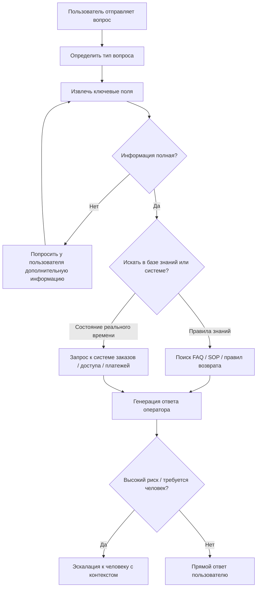
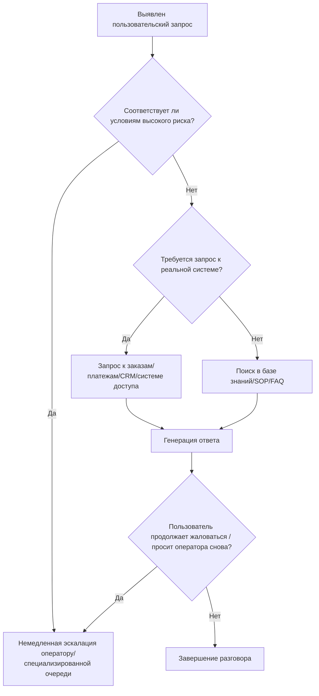

<!-- nav -->
**📚 Версии:** [Кратко](../../../lesson-summaries/stage-3/ai-advanced/langgraph-advanced-rag.md) · [Расширенно](../../../lesson-summaries-full/stage-3/ai-advanced/langgraph-advanced-rag.md) · **Полный перевод** · [Оригинал 中文](https://github.com/datawhalechina/easy-vibe/blob/main/docs/zh-cn/stage-3/ai-advanced/langgraph-advanced-rag/index.md)

# Практический опыт разработки Enterprise-класса Customer Service Agent с LangGraph

Если вы уже выполняли вопросо-ответные задачи на основе знаниевой базы, то следующий шаг, достойный изучения — это не просто добавить больше подсказок, а начать понимать: как на самом деле должна быть спроектирована система Agent для реального корпоративного потока обслуживания клиентов.

В этой главе мы делаем одно: разбираем коммерческую систему интеллектуального обслуживания клиентов через призму LangGraph. Акцент делается не на деталях кода, а на деловой логике, обработке исключений, эскалации к человеку, проектировании данных и граничных условиях для продакшена.

## Быстрый старт

Если вы готовы начать прямо сейчас, представьте себе такой сценарий:

Пользователь пишет вечером в 22:00: "Я же заплатил деньги, почему курс всё ещё не открывается?" В этом случае настоящий Production-ready Customer Service Agent не спешит давать ответ. Вместо этого он сначала проверяет: это проблема с доступом, нужен ли номер заказа, требуется ли запрос к системе платежей, нужна ли эскалация к человеку.

Если вы можете запомнить только одну фразу, то вот она:

> **Цель Enterprise-класса Customer Service Agent — это не "ответить на больше вопросов", а "автоматизировать, когда нужно, задавать дополнительные вопросы, когда неуверен, и эскалировать при высоких рисках".**

## 1. Бизнес-сторона: сначала определить, какую работу должна выполнять эта система

Корпоративный Customer Service Agent проектируется не с вопроса "модель мощная, что с ней можно сделать", а с вопроса "какую работу бизнес действительно хочет автоматизировать".

Самый распространённый способ начать — ответить на эти вопросы:

1. Какие проблемы возникают чаще всего?
2. Какие проблемы имеют чёткие правила и лучше всего подходят для автоматизации?
3. Какие проблемы слишком рискованны для автоматического решения?
4. Какие проблемы требуют интеграции с бизнес-системами, а не только с базой знаний?

Если эти вопросы не продуманы, то система будет выглядеть "умной на демо" и "небезопасной для реального использования", независимо от того, используете ли вы LangGraph, Dify или другой Agent runtime.

### 1.1 Рассматривайте Customer Service как бизнес-процесс, а не как чат-бота

LangGraph подходит для Customer Service не потому, что он "лучше общается", а потому, что Customer Service по своей сути — это проблема состояния и переходов между состояниями.

Например, когда пользователь говорит:

> "Вчера я купил курс, и он всё ещё не открывается. Ты можешь помочь?"

Зрелая система Customer Service не спешит ответить. Вместо этого она сначала определяет:

1. Это проблема платежа, доступа, возврата или аккаунта?
2. Есть ли полная информация: номер заказа, аккаунт, время покупки?
3. Нужно ли искать в базе знаний или нужен запрос к бизнес-системе?
4. Это обычный запрос или высокорисковая жалоба?
5. Это должен решить автомат или нужна эскалация?

Вот минимальная, но достаточно реалистичная диаграмма потока обслуживания:



Самое важное в этой диаграмме — это не названия узлов, а то, что она выражает деловую логику:

1. Остановиться, когда информация неполная
2. Разделить проблемы на две категории: вопросы по документам и вопросы по реальным данным
3. Не давать твёрдый ответ на высокорисковые проблемы

### 1.2 Использовать реальный бизнес-сценарий для построения системы

Чтобы сделать эту главу более похожей на корпоративное решение, а не на абстрактное описание фреймворка, мы используем пример системы обслуживания клиентов онлайн-платформы обучения. Этот Agent главным образом обрабатывает четыре типа вопросов:

1. Курс не открывается, подписка не активирована
2. Платёж прошёл, но страница показывает ошибку
3. Объяснение правил возврата и проверка статуса возврата
4. Жалобы, повторные списания, запросы о переводе на оператора

Соответствующие реальные пользовательские запросы могут быть такими:

- "Я вчера заплатил, но курс по-прежнему заблокирован."
- "Почему я не вижу продвинутые главы после входа?"
- "Платёж был снят со счёта, но страница не показала успех."
- "Могу ли я вернуть деньги за этот заказ?"
- "Мне нужен оператор, ваш бот не помог."

Все эти входные данные неструктурированные, поэтому первый принцип корпоративной системы Customer Service — это не "быстро ответить", а "сначала правильно понять задачу".

Вы можете начать с одного prompt для выполнения первого этапа бизнес-логики:

```text
Вы являетесь помощником по "классификации проблем и сбору недостающей информации" в системе корпоративного обслуживания клиентов.

Ваша задача — не решать все проблемы напрямую, а выполнить следующие действия:
1. Определить, к какой категории относится вопрос пользователя: FAQ, запрос по заказу/доступу, возврат/жалоба, высокий риск для эскалации.
2. Извлечь ключевые поля: аккаунт, номер заказа, время, название товара, канал связи.
3. Если информации недостаточно, не угадывайте, не давайте выводы напрямую — сгенерируйте одно короткое и естественное уточняющее вопрос.
4. Если пользователь явно просит оператора или упоминает повторные списания, жалобы, юридические вопросы, приватность, интенсивное эмоциональное выражение — отметьте это как высокий риск для эскалации.

Формат вывода:
- Тип проблемы:
- Ключевая информация:
- Отсутствует ли информация:
- Следующее действие:
- Что сказать пользователю:
```

Основная ценность такого prompt — не в том, чтобы "сделать модель умнее", а в том, чтобы с самого первого шага установить бизнес-границы для системы.

### 1.3 Коммерческий Customer Service сосредоточен не только на ответах, но на маршрутизации

Если вы посмотрите на коммерческие решения Customer Service, такие как Zendesk, Intercom и Salesforce, вы заметите, что они делают одно и то же: сначала разделяют запросы по деловой ценности и уровню риска.

Более приближенная к корпоративной практике иерархия обычно выглядит так:

#### Высокая параллелизм, низкий риск, самостоятельное замыкание

Эти проблемы наиболее подходят для приоритетной автоматизации, так как они часто возникают, имеют чёткие правила и прямое окупаемость.

Примеры:

1. Сброс пароля
2. Открыта ли подписка курс / член / доступ
3. Успешен ли платёж за заказ
4. Счета, загрузки, вход
5. Объяснение основных правил возврата

#### Проблемы, требующие дополнительной информации

Многие пользователи не предоставляют полную информацию сразу, поэтому система должна научиться сначала уточнять.

Примеры:

- "Я заплатил, но курс по-прежнему не открывается."
- "Проверь, не сломан ли этот заказ."
- "Почему моя подписка всё ещё не активирована?"

Наиболее частая проблема с такими запросами — система угадывает.

#### Полуавтоматические проблемы, требующие запроса к системе

Эти проблемы нельзя решить только по базе знаний, потому что реальный ответ находится в бизнес-системе.

Примеры:

1. Прошёл ли платёж за заказ успешно
2. Вошёл ли возврат в процесс финансирования
3. Является ли пользователь VIP
4. Действительно ли активирован доступ к курсу

#### Проблемы, требующие эскалации к оператору или специализированной очереди

Здесь кроется главное различие в системах корпоративного уровня.

Типичные высокорисковые проблемы включают:

1. Повторные списания
2. Жалобы и интенсивные эмоции
3. Юридические, приватность, нормативные запросы
4. Мошенничество, блокировка аккаунта, обман
5. Отрицательные запросы от высокоценных клиентов

Вот диаграмма, более приближенная к коммерческому решению для маршрутизации эскалации:



## 2. Техническая сторона: определить, как реализовать эти функции

После того, как бизнес-сторона выяснила "какие проблемы автоматизировать, какие обязательно эскалировать, какие требуют запроса к системе", техническая сторона становится ясной.

На этом этапе вам нужно реализовать не "робота для общения", а следующие модули:

1. Модуль классификации намерений
2. Модуль извлечения ключевой информации
3. Модуль сбора недостающей информации
4. Модуль поиска в базе знаний
5. Модуль запроса к бизнес-системам
6. Модуль оценки риска
7. Модуль передачи оператору

### 2.1 Как реализовать переходы между модулями

Если вы хотите реализовать весь процесс в коде, вы можете рассматривать его как упрощённую архитектуру переходов между модулями:

```ts
type CustomerServiceState = {
  userMessage: string
  intent?: "faq" | "order" | "refund" | "risk"
  missingFields: string[]
  riskLevel?: "low" | "medium" | "high"
  knowledgeResult?: string
  businessResult?: string
  finalReply?: string
  handoffToHuman: boolean
}

function runCustomerServiceFlow(state: CustomerServiceState) {
  state = classifyIntent(state)
  state = extractFields(state)

  if (state.missingFields.length > 0) return askForMoreInfo(state)
  if (state.intent === "faq") state = searchKnowledgeBase(state)
  else state = queryBusinessSystems(state)

  state = evaluateRisk(state)
  if (state.handoffToHuman) return handoffWithContext(state)
  return generateReply(state)
}
```

Этот код намеренно упрощён. Вам не нужно пока беспокоиться об API фреймворка — просто поймите одно: суть Enterprise Customer Service Agent — это не "модель отвечает один раз", а "состояние переходит между несколькими модулями".

### 2.2 Данные, мониторинг и обработка исключений

Реальная коммерческая система Customer Service опирается на данные, значительно выходящие за рамки истории чатов.

Как минимум должно быть три уровня:

1. **Данные входа**: оригинальное сообщение пользователя, канал, язык, недавний диалог, повторный запрос, запрос оператора
2. **Данные бизнеса**: аккаунт, заказ, статус платежа, статус доступа, уровень клиента, история жалоб, регион, тариф
3. **Данные операций**: коэффициент автоматического разрешения, коэффициент эскалации, время первого ответа, повторное поступление, коэффициент отказов, удовлетворённость

Если эти данные не структурированы, система не будет по-настоящему enterprise.

Равно важна обработка исключений. Худшее, что может произойти в корпоративном Customer Service — это не короткие ответы, а претендование на знание в условиях неопределённости.

Здесь четыре распространённые проблемы:

1. Ответ при неполной информации
2. Имитация успешного запроса при превышении времени
3. Продолжение автоматических ответов, когда пользователь явно недоволен
4. Высокорисковые проблемы обрабатываются как обычные FAQ

Вы можете использовать следующий prompt для систематизации обработки исключений и правил эскалации:

```text
Вы являетесь помощником по "определению исключений и решению об эскалации" в системе корпоративного обслуживания.

Определите, требуется ли текущей сессии человеческая эскалация или понижение уровня обработки.

Эскалируйте на оператора, если выполнено одно из условий:
1. Пользователь явно просит оператора
2. Выявлены повторные списания, жалобы, юридические вопросы, приватность, мошенничество, блокировка, спор о возврате
3. Эмоции пользователя явно интенсивны или два подряд сообщения выражают недовольство
4. Запрос к системе не удался, вышло время, конфликтующие результаты
5. Доказательств недостаточно для уверенного вывода

Если не эскалируется, обязательно выведите:
1. Текущий уровень риска
2. Разрешены ли автоматические ответы
3. Если автоматический ответ, какой самый консервативный способ ответа
4. Если запрос не удался, как объяснить пользователю

Формат вывода:
- Уровень риска:
- Эскалировать ли на оператора:
- Причина:
- Что сказать пользователю:
```

Если вы хотите реализовать "маршрутизацию" с минимальным кодом, обычно это выглядит так:

```ts
function routeTicket(state: CustomerServiceState) {
  if (state.riskLevel === "high") return "human_handoff"
  if (state.missingFields.length > 0) return "ask_user"
  if (state.intent === "faq") return "knowledge_lookup"
  return "business_lookup"
}
```

Реальные корпоративные проекты, конечно, сложнее, но обычно сводятся к четырём направлениям: сбор информации, поиск в базе знаний, запрос к системе, передача оператору.

## 3. Заключение: как определить, достаточно ли это enterprise-класса

Настоящий Customer Service Agent, который может попасть в корпоративный продакшен, обычно должен удовлетворять как минимум этим критериям:

1. Чёткие границы обслуживания: что может быть автоматизировано, а что нет
2. Механизм передачи оператору: при эскалации пользователь не повторяет всё с начала
3. Аудит и отслеживание: впоследствии можно разобрать, почему был сделан такой выбор маршрутизации
4. Серые развёртывания и откаты: не выкатывать на всех после изменения prompt
5. Операционные метрики: не просто "звучит ли как человек"

Более полный список — вам также нужно подготовить:

- Слои доступа: разные роли видят разные данные
- SLA и таймауты: что делать, если не получили результат
- Оффлайн тестовое множество: охватывает частые, граничные и высокорисковые проблемы
- Обратная связь от операторов: результаты работы операторов должны улучшать систему

Без всего этого система — это лишь красиво выглядящий demo Customer Service.

## 4. Рекомендуемый порядок внедрения

Если вы действительно будете это делать, рекомендуем такой порядок:

1. Начните с одного частого низкорискового сценария
2. Сначала напишите реальные пользовательские входы, потом состояния и маршрутизацию
3. Интегрируйте один источник знаний и одну бизнес-систему
4. Потом добавьте эскалацию, обработку исключений и операционные метрики
5. Только потом рассмотрите более сложную оркестровку Agent

## Заключение

LangGraph подходит для корпоративного Customer Service не потому, что он делает ответы более изящными, а потому, что он может ясно выразить самое важное в системе Customer Service: маршрутизацию, состояния, уточнения, запросы, эскалации, отслеживание.

Когда вы начнёте рассматривать Customer Service как управляемый бизнес-процесс, а не как говорящего робота, вы действительно попадёте в область дизайна enterprise-класса интеллектуального Customer Service.

## Дополнительные публичные примеры и рекомендуемое чтение

Если вы хотите углубиться в enterprise-направление, вот материалы, которые стоит прочитать:

1. **LangChain Official `Thinking in LangGraph`**
   Лучше всего подходит для понимания того, "почему процессы Customer Service должны сначала разделять состояние, а потом писать узлы".

2. **Klarna**
   Подходит для изучения того, почему в крупномасштабных сценариях Customer Service автоматизация, коэффициент эскалации и эффективность ответа важнее "естественного тона".

3. **Minimal**
   Подходит для изучения того, как несколько Agent действительно интегрируются в платформы Customer Service, такие как Zendesk, Front и Gorgias, вместо того, чтобы оставаться в чатах.

4. **Podium**
   Подходит для изучения того, почему enterprise Customer Service не может обойтись без trace, оценки и регрессионного тестирования.

5. **Zendesk / Intercom / Salesforce**
   Подходит для изучения того, как коммерческие продукты обрабатывают handoff, sentiment, VIP маршрутизацию и операционные метрики.

6. **CFPB**
   Подходит для изучения того, почему с регуляторной точки зрения плохие chatbots ловят пользователей в "doom loops" и почему человеческая поддержка не опциональна.

## Справочные материалы

- LangGraph Overview: [https://docs.langchain.com/oss/python/langgraph/overview](https://docs.langchain.com/oss/python/langgraph/overview)
- Thinking in LangGraph: [https://docs.langchain.com/oss/python/langgraph/thinking-in-langgraph](https://docs.langchain.com/oss/python/langgraph/thinking-in-langgraph)
- Built with LangGraph: [https://www.langchain.com/built-with-langgraph](https://www.langchain.com/built-with-langgraph)
- Klarna Customer Story: [https://blog.langchain.dev/customers-klarna/](https://blog.langchain.dev/customers-klarna/)
- Minimal Customer Support System: [https://blog.langchain.dev/how-minimal-built-a-multi-agent-customer-support-system-with-langgraph-langsmith/](https://blog.langchain.dev/how-minimal-built-a-multi-agent-customer-support-system-with-langgraph-langsmith/)
- Podium Customer Story: [https://blog.langchain.dev/customers-podium/](https://blog.langchain.dev/customers-podium/)
- Zendesk AI for Service: [https://www.zendesk.com/service/ai/](https://www.zendesk.com/service/ai/)
- Intercom Fin: [https://www.intercom.com/fin](https://www.intercom.com/fin)
- Salesforce AI for Service: [https://www.salesforce.com/service/ai/](https://www.salesforce.com/service/ai/)
- CFPB Chatbot Guidance: [https://www.consumerfinance.gov/about-us/newsroom/cfpb-issues-guidance-to-prevent-harmful-chatbot-practices/](https://www.consumerfinance.gov/about-us/newsroom/cfpb-issues-guidance-to-prevent-harmful-chatbot-practices/)
