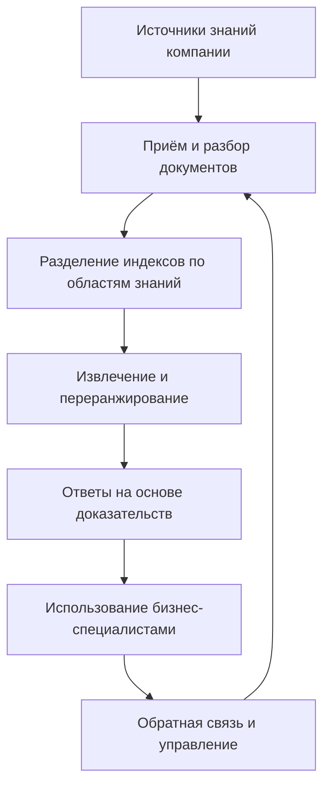
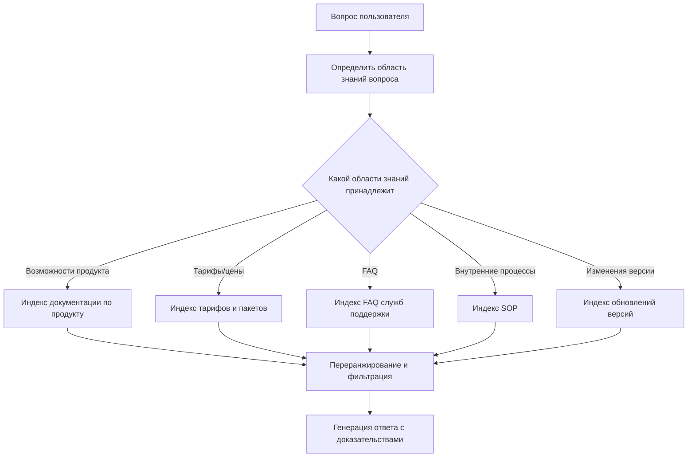

# Собираем корпоративную систему знаний на LlamaIndex: практика внедрения RAG в реальном окружении

<!-- nav -->
**📚 Версии:** [Кратко](../../../lesson-summaries/stage-3/ai-advanced/llamaindex-enterprise-knowledge-base.md) · [Расширенно](../../../lesson-summaries-full/stage-3/ai-advanced/llamaindex-enterprise-knowledge-base.md) · **Полный перевод** · [Оригинал 中文](https://github.com/datawhalechina/easy-vibe/blob/main/docs/zh-cn/stage-3/ai-advanced/llamaindex-enterprise-knowledge-base/index.md)


Если LangGraph лучше всего подходит для решения вопроса "как должен работать клиентский сервис или Agent", то LlamaIndex лучше решает другой, не менее важный вопрос: как знания компании должны быть подключены, организованы, извлечены и на них должны даны ответы.

В этой главе мы фокусируемся только на корпоративных знаниях. Основной упор не на написание большого объёма кода, а на понимание того, какие реальные проблемы должна решать система знаний, способная работать внутри корпоративной среды.

# Быстрый старт

Если вы хотите начать сразу, представьте себе простой сценарий:

Ваши коллеги из отдела продаж каждый день задают вам одни и те же типы вопросов: "Поддерживает ли корпоративная версия эту функцию?", "Чем отличается новая версия от старой?", "Как лучше сформулировать это текст для клиента?". Вам нужно взять ответы, разбросанные по документации продукта, FAQ и логам обновлений, собрать их в единого внутреннего помощника по знаниям, который можно спрашивать в любой момент и который даёт относительно стабильные ответы.

Если вы можете запомнить только одно предложение:

> Корпоративная система знаний — это не "просто скормить PDF модели", а "превратить разбросанные знания в единый, поддерживаемый, доступный для поиска и отслеживаемый источник".

# 1. На стороне бизнеса: сначала определите, какую проблему должна решить система знаний

Корпоративная система знаний проектируется не с вопроса "какой фреймворк восстановления выбрать", а с вопроса "какие вопросы ваши отделы задают снова и снова каждый день".

Если вы не разобрались с этими вопросами, то позже, независимо от того, используете ли вы LlamaIndex, другой RAG-фреймворк или собственное решение, система получится "можно искать, но неудобно пользоваться".

## 1.1 Рассматривайте систему знаний как систему знаний, а не как хранилище загруженных страниц

Многие при первой разработке системы знаний естественно думают:

> "Загрузим всё туда, и всё будет работать?"

Но в реальном корпоративном окружении знания имеют по крайней мере эти характеристики:

1. Источников много, это не только PDF
2. Обновления происходят очень часто, старые ответы быстро теряют актуальность
3. Разные документы имеют разный уровень надёжности
4. Часть — это документы, часть — базы данных или таблицы конфигураций
5. Некоторые вопросы нельзя ответить только на основе документов, нужно также обратиться к живым системам

Поэтому на самом деле корпоративная система знаний решает не "есть ли у нас документы", а:

1. Где их искать
2. Какой источник наиболее надёжный
3. Как избежать помех от старых версий
4. Как стабильно организовать найденное в ответ

Вот диаграмма, которая очень хороша для входа в корпоративные системы знаний:



Самый важный сигнал на этой диаграмме: корпоративная система знаний — это не одноразовый проект, а постоянный цикл управления.

## 1.2 Проектируйте на основе реального сценария бизнеса

Чтобы избежать излишней абстрактности, определим очень распространённый сценарий корпоративной системы знаний:

Вам нужно создать **внутреннего помощника по знаниям о продукте**, который служит клиентской поддержке, отделу продаж и команде имплементации.

Обычно он должен ответить на вопросы вроде:

- "Корпоративная версия поддерживает несколько потоков согласования?"
- "Когда клиент спрашивает, что нового в управлении правами по сравнению с базовой версией, что именно это?"
- "Эту функцию видит только администратор или обычные участники тоже могут использовать?"
- "Я помню, что в документации было написано 100 пользователей максимум, а теперь это другое число?"
- "Можете ли вы написать текст обновления, который я могу отправить клиентам?"

Все эти вопросы похожи на реальный рабочий язык, а не на запросы к базе данных.

И именно поэтому первый шаг в корпоративной системе знаний — это не "векторизация", а признание того, что:

> Как пользователь задаёт вопрос и как пишется корпоративная документация — часто это совсем разные языки.

Вы можете сначала использовать подсказку для понимания вопроса и маршрутизации знаний:

```text
Вы — помощник по пониманию вопросов и маршрутизации знаний в корпоративной системе знаний.

Ваша задача:
1. Определить, к какой области знаний принадлежит вопрос пользователя: функции продукта, тарифы и цены, FAQ, внутренние SOP, обновления версий.
2. Определить, лучше ли искать в документах, FAQ или нужны ли данные бизнес-систем.
3. Если вопрос связан с конфликтом между старой и новой версией, обратите внимание системы на последнюю версию документов.
4. Если вопрос выходит за рамки возможностей системы знаний, не выдумывайте, чётко укажите, нужно ли проверить бизнес-систему или подтвердить вручную.

Формат вывода:
- Область знаний вопроса:
- Рекомендуемый источник поиска:
- Может ли быть конфликт версий:
- Нужно ли дополнение от бизнес-системы:
- Подсказка для верхних слоёв по извлечению:
```

Ценность этой подсказки в том, что она сначала решает вопрос "где искать знания".

## 1.3 Самый важный замысел в корпоративной системе знаний — не извлечение, а разделение

Низкое качество работы корпоративной системы знаний чаще всего происходит не из-за слабой модели, а потому что все документы смешаны в одну кучу.

Более правильный способ, как в реальных корпоративных проектах, — сначала разделить по областям знаний, например:

1. Документация по функциям продукта
2. Описание пакетов и цены
3. FAQ для служб поддержки
4. Внутренние SOP
5. Логи обновлений версий

Почему это лучше? Потому что когда пользователь спрашивает:

> "Какие возможности добавила последняя версия?"

и когда пользователь спрашивает:

> "Какова политика возвращения?"

Совершенно очевидно, что не стоит сначала ищать в одних и тех же материалах.

Вот диаграмма маршрутизации, более соответствующая проектированию поиска в корпоративной системе знаний:



Вот почему LlamaIndex хорошо подходит для корпоративных систем знаний. Это не просто помощник по "извлечению векторов", это удобнее организовывает знания из разных источников, на разные темы и с разными правилами.

# 2. На стороне техники: затем определите, как реализовать эти функции

Когда бизнес-сторона уже разобралась, "какие проблемы наиболее частые, какие области знаний нужно разделить, какие вопросы нельзя решить только документами", тогда техническая сторона может определить цель.

То, что вы действительно должны реализовать, обычно это не "большое и всеобъемлющее окно чата", а эти модули:

1. Модуль маршрутизации вопросов
2. Модуль приёма и разбора документов
3. Модуль многоуровневых индексов по областям знаний
4. Модуль извлечения и переранжирования
5. Модуль ответов на основе доказательств
6. Модуль контроля версий и авторитетных источников

## 2.1 Как разместить поток модулей

Если вы хотите думать об этой системе как об инженерных модулях, сначала посмотрите минимальный скелет:

```ts
type KnowledgeQuery = {
  question: string
  domain?: "product" | "pricing" | "faq" | "sop" | "release_notes"
  needsBusinessData?: boolean
}

function answerWithKnowledgeBase(query: KnowledgeQuery) {
  const routed = routeQuery(query)
  const docs = retrieveDocuments(routed)
  const ranked = rerankDocuments(docs, routed)
  return generateGroundedAnswer(ranked, routed)
}
```

Этот код намеренно не использует конкретные API фреймворков. Он просто помогает вам схватить основу корпоративной системы знаний: сначала маршрутизация, затем извлечение, затем переранжирование, в конце — ответ на основе доказательств.

## 2.2 Управление, границы и доказательства

Если вы посмотрите на более реальные примеры, вы заметите, что действительно сложное — это управление.

Корпоративная система знаний обычно должна иметь по крайней мере эту ответственность:

### Сознание версии

Пользователь спрашивает:

> "Я помню, что в документации было написано 100 пользователей максимум, а сейчас это всё ещё так?"

Самый большой риск для таких вопросов — это не невозможность найти, а найти старое правило.

Поэтому корпоративная система должна стараться:

1. Приоритет новейшей версии
2. Разделять исторические документы
3. Не допускать, чтобы старые документы перекрывали текущие правила

### Сознание авторитетного источника

На один и тот же вопрос FAQ, руководство по продукту, продажная речь и внутренний SOP могут дать немного разные ответы.

Корпоративная система должна определить:

1. По умолчанию кого считать правым
2. Какие документы только для внутреннего использования
3. Какие документы можно выражать внешне

### Сознание границ системы

Система знаний может ответить:

1. На правила
2. На определения
3. На объяснения функций
4. На объяснения процессов

Но она не должна в одиночку ответить:

1. На вопрос, активирована ли функция для конкретного клиента
2. На вопрос, на каком этапе находится конкретный возврат денег
3. На вопрос, каков текущий статус разрешений на конкретном аккаунте

Эти вопросы часто требуют обращения к живым системам.

Поэтому одна из самых важных способностей зрелой системы знаний — это знать, когда нужно сказать:

> "Этот вопрос требует запроса к бизнес-системе, я сейчас могу только подтвердить правила, но не могу напрямую подтвердить текущий статус."

# 5. Какие данные, оценки и обработка исключений нужны для корпоративной системы знаний

Данные, на которые действительно полагается корпоративная система знаний, обычно имеют три слоя:

1. Данные со стороны документов: источник, версия, время обновления, область знаний, уровень авторитета
2. Данные со стороны запросов: вопросы пользователей, целевые области знаний, результаты извлечения, цепочка доказательств
3. Данные со стороны эксплуатации: какие вопросы часто задаются, какие ответы часто переписываются, какие документы часто ссылаются, какие вопросы часто решены неправильно

Действительно важная корпоративная система знаний должна особенно внимательно относиться к плохим случаям.

Самые распространённые плохие случаи:

1. Ссылка на старый документ
2. Смешивание речи разных отделов
3. Выглядит как правильный ответ, но источник доказательства не авторитетен
4. В документах нет ответа, но он был придуман
5. Нужно было запросить бизнес-систему, но вместо этого только запросили документы

Вы можете использовать эту подсказку, чтобы сделать ограничения доказательств более стабильными:

```text
Вы — помощник по предоставлению ответов на основе доказательств в корпоративной системе знаний.

Пожалуйста, строго ответьте на основе полученной справочной информации:
1. Приоритет — использовать самую свежую и авторитетную информацию.
2. Если между разными источниками есть конфликт, чётко укажите на конфликт, не выдумывайте единое заключение.
3. Если доказательств недостаточно, чётко укажите "на основе текущей информации невозможно подтвердить".
4. Если вопрос о текущем статусе в бизнесе, чётко укажите, что нужно проверить бизнес-систему.

Формат вывода:
- Главное заключение:
- Источники доказательств:
- Есть ли конфликт версий:
- Нужно ли дополнение от бизнес-системы:
- Что сказать пользователю:
```

Если вы хотите превратить "ответ на основе доказательств" в минимальный модуль, вы можете понимать это так:

```ts
function generateGroundedAnswer(docs: string[], query: KnowledgeQuery) {
  if (docs.length === 0) {
    return "На основе текущей информации невозможно подтвердить, нужно дополнить источники знаний или обратиться к человеку."
  }
  return llmAnswer({
    question: query.question,
    evidence: docs,
    rule: "Ответьте только на основе доказательств; если доказательств недостаточно, чётко скажите, что не знаете."
  })
}
```

Самое важное в этом коде — это не реализация, а принцип: когда доказательств недостаточно, система должна уметь остановиться.

Настоящий профессионализм корпоративной системы знаний обычно выражается именно здесь: не в том, чтобы давать длинные ответы, а в том, чтобы давать стабильные ответы.

## 2.3 Минимальная маршрутизация по областям знаний

Если вы хотите написать "маршрутизацию по областям знаний" как минимум кода, обычно это выглядит так:

```ts
function routeQuery(query: KnowledgeQuery) {
  if (query.question.includes("цена") || query.question.includes("пакет")) {
    return { ...query, domain: "pricing" }
  }
  if (query.question.includes("обновление") || query.question.includes("новая версия")) {
    return { ...query, domain: "release_notes" }
  }
  return { ...query, domain: "product" }
}
```

Конечно, в реальных проектах маршрутизация не будет основываться только на ключевых словах, но этот минимальный пример очень ценен, потому что он показывает суть: ключ корпоративной системы знаний — это не "проверить все документы", а "сначала постараться искать в правильном месте".

# 3. Заключение: как узнать, достаточно ли она корпоративного уровня

Система знаний, которая действительно может быть длительно использована в компании, обычно должна соответствовать по крайней мере этим критериям:

1. Есть управление знаниями, а не только загрузка документов
2. Есть разделение по областям знаний, а не один супер-большой индекс
3. Есть сознание версии, не позволяющее старым правилам перекрывать текущие
4. Есть контроль прав, не все видят одинаковое содержимое
5. Есть оценка и отслеживание, можете постоянно знать, где ошибки

Более полно, вам также лучше подготовить:

- Управление жизненным циклом документов
- Определение авторитетных источников
- Стратегия обновления
- Ответы на основе доказательств
- Путь падения при отказе
- Замкнутый цикл обратной связи от использования

Без этого система максимум это "демо для ответов на вопросы о документах".

# 4. Рекомендуемый порядок внедрения

Рекомендуется продвигаться в таком порядке:

1. Сначала выберите узкий объект бизнеса
2. Сначала соберите реальные вопросы, затем решите, какие источники подключить
3. Сначала сделайте разделение по областям знаний, потом делайте сложный поиск
4. Сначала решите проблемы доказательств и версий, потом преследуйте более естественные ответы
5. И наконец, подумайте о более глубокой интеграции с Agent, системами служб поддержки и CRM

# Резюме

LlamaIndex лучше всего подходит не как "ещё один фреймворк для общения", а как слой доступа к знаниям и данным предприятия.

Когда вы переводите систему знаний из "загрузки страниц" на уровень "управления знаниями, маршрутизированного поиска, ответов на основе доказательств, постоянного обновления", вы действительно входите в проектирование корпоративной системы знаний.

# Дополнительные открытые примеры и расширенное чтение

Если вы хотите продолжить углубление в корпоративном направлении, эти материалы наиболее стоят внимания:

1. **Jeppesen (дочерняя компания Boeing)**
   Подходит для понимания, почему в сценарии инженерных знаний система знаний в первую очередь является инфраструктурой производительности.

2. **Microsoft + LlamaIndex**
   Подходит для понимания того, как вход в корпоративные знания становится частью платформы корпоративного AI.

3. **Клиенты LlamaIndex и сборка примеров на официальном сайте**
   Подходит для понимания различий во внедрении системы знаний в разных сценариях у KPMG, Rakuten, Salesforce, Cemex и других.

4. **LlamaCloud**
   Подходит для понимания проблем с приёмом корпоративных документов, разбором, синхронизацией и долгосрочным обслуживанием.

5. **Случаи использования и страница вопросов и ответов**
   Подходит для понимания того, как корпоративная система знаний служит основой для систем поддержки клиентов, корпоративного поиска, помощников для исследований и других систем.

# Reference

- LlamaIndex Use Cases: [https://docs.llamaindex.ai/en/stable/use_cases/](https://docs.llamaindex.ai/en/stable/use_cases/)
- LlamaIndex Q&A Use Cases: [https://docs.llamaindex.ai/en/stable/use_cases/q_and_a/](https://docs.llamaindex.ai/en/stable/use_cases/q_and_a/)
- LlamaIndex Customers: [https://www.llamaindex.ai/customers](https://www.llamaindex.ai/customers)
- LlamaIndex Homepage: [https://www.llamaindex.ai/](https://www.llamaindex.ai/)
- Jeppesen Customer Story: [https://www.llamaindex.ai/customers/jeppesen-a-boeing-company-saves-2-000-engineering-hours-with-unified-chat-framework](https://www.llamaindex.ai/customers/jeppesen-a-boeing-company-saves-2-000-engineering-hours-with-unified-chat-framework)
- Microsoft Customer Story: [https://www.microsoft.com/en/customers/story/23695-llamaindex-azure-open-ai-service](https://www.microsoft.com/en/customers/story/23695-llamaindex-azure-open-ai-service)
- LlamaCloud Documentation: [https://docs.cloud.llamaindex.ai/](https://docs.cloud.llamaindex.ai/)
- LlamaCloud in Docs: [https://docs.llamaindex.ai/en/latest/llama_cloud/](https://docs.llamaindex.ai/en/latest/llama_cloud/)
