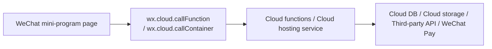

# Как построить микропрограмму WeChat с бэкенд-частью

<!-- nav -->
**📚 Версии:** [Кратко](../../../lesson-summaries/stage-3/cross-platform/wechat-miniprogram-backend.md) · [Расширенно](../../../lesson-summaries-full/stage-3/cross-platform/wechat-miniprogram-backend.md) · **Полный перевод** · [Оригинал 中文](https://github.com/datawhalechina/easy-vibe/blob/main/docs/zh-cn/stage-3/cross-platform/wechat-miniprogram-backend/index.md)

В предыдущем уроке мы создали "микропрограмму, которая полностью работает во фронтенде". Но как только ваш продукт начнёт приближаться к реальному бизнесу, вы быстро столкнётесь с несколькими типами требований:

- После входа пользователя вам нужно понять "кто это"
- Данные не могут храниться только локально, а должны синхронизироваться между устройствами
- Изображения, аудио, документы нужно загружать в облако
- Логика заказов, платежей, членства, баллов не может быть открыта на фронтенде
- Вы хотите подключить ИИ, базы данных, админ-панель, запланированные задачи, уведомления

В этом случае вы перестаёте делать просто "страницу микропрограммы" и начинаете делать полноценный продукт микропрограммы. Ему нужен как фронтенд, так и бэкенд.

По состоянию на **25 марта 2026 года**, если ваша цель — "как можно быстрее создать реально действующую микропрограмму для публикации, избегая подводных камней инфраструктуры", то рекомендуемый маршрут — это не сразу покупать собственные серверы, не настраивать Nginx и не писать кучу middleware аутентификации, а:

> **Рекомендуемый маршрут**
> 
> **Приоритет: WeChat mini-program + WeChat CloudBase**
> 
> То есть использовать:
> 
> - Фронтенд микропрограммы отвечает за интерфейс и взаимодействие
> - Облачные функции или облачный хостинг отвечают за логику бэкенда
> - Облачная база данных отвечает за хранение данных
> - Облачное хранилище отвечает за файлы
> - Правила безопасности, проверка контента, логирование и другие возможности как стандартный набор для публикации

Причина проста: этот маршрут максимально близок к экосистеме WeChat. Передача состояния входа, идентификация пользователя, загрузка файлов, доступ к БД, вызовы функций сервера — всё работает более гладко. Это особенно подходит для новичков, независимых разработчиков, MVP, контентных продуктов, утилит и вашего текущего сценария **"быстро создать продукт с помощью ИИ"**.

Конечно, это не означает, что "самостоятельный бэкенд" бесполезен. Настоящая лучшая практика — не использовать один и тот же подход для всех проектов, а **сначала выбрать наиболее удобный стандартный вариант, а затем при необходимости перейти на более сложную архитектуру**.

# 1. Что означает "микропрограмма с бэкенд-частью"

Самое простое объяснение:

- **Фронтенд**: интерфейс, работающий в WeChat, отвечает за отображение страниц, получение кликов, отправку запросов
- **Бэкенд**: работает на сервере или в облаке, отвечает за проверку идентичности, чтение/запись БД, подписание платежей, бизнес-логика, вызовы сторонних API

Зрелая микропрограмма обычно разделяет ответственность на три уровня:

1. **Уровень фронтенда микропрограммы**

Отвечает за интерфейс страницы, ввод формы, отображение списков, состояния загрузки, сообщения об ошибках, действия пользователя.

2. **Уровень бизнес-логики**

Отвечает за "действительно важные" вещи, например: создание заказа, проверка разрешений, уменьшение запасов, генерация параметров платежа, вызов большой модели, проверка контента, запись логов операций.

3. **Уровень данных и ресурсов**

Отвечает за хранение данных пользователя, содержимого статей, информации о заказах, загруженных файлов, ресурсов изображений, результатов проверки.

Эти три уровня не должны перемешиваться. Особенно второй уровень — ни в коем случае не должен быть просто закинут на фронтенд для экономии времени.

## 1.1 Какие операции обязательно должны быть на бэкенде

Следующие возможности в принципе должны быть размещены на сервере, а не написаны прямо на фронтенде микропрограммы:

- `AppSecret`, ключи платежей, приватные ключи торговца, ключи сторонних платформ
- Обмен состояния входа, привязка идентичности пользователя, определение прав администратора
- Инициирование платежа, генерация подписи, проверка подписи обратного вызова платежа
- Контроль прав записи в БД
- Бизнес-правила цены, запасов, баллов, купонов
- Проверка контента, контроль рисков, ограничение скорости, защита от спама
- Запланированные задачи, пакетная обработка, асинхронные задачи

Если логика касается "ключей, разрешений, сумм, неизменяемых бизнес-правил", не размещайте её на фронтенде.

# 2. Какова наиболее рекомендуемая архитектура

Для большинства проектов, в которых вы первый раз делаете "микропрограмму + бэкенд", я рекомендую вам использовать следующую архитектуру:



Основная идея, лежащая в основе этого маршрута:

- **Фронтенд как можно более тонкий**
  Только интерфейс, сбор параметров, отображение результатов, не трогайте ключи и критичную бизнес-логику напрямую.
- **Бэкенд как можно более централизованный**
  Пусть все аутентификация, платежи, запись данных, контроль разрешений проходят через вход сервера.
- **Разрешения данных по умолчанию ограничены**
  Сначала отклоняйте по умолчанию, затем открывайте по ролям и сценариям.
- **Сначала используйте управляемые возможности для замыкания цепи**
  Сначала создайте продукт, потом думайте, нужно ли вам разделить его на более сложные микросервисы.

## 2.1 Три опциональных маршрута

### Маршрут A: Облачная разработка (рекомендуется по умолчанию)

Лучше всего подходит для:

- Новичков, делающих свою первую микропрограмму с бэкенд-частью
- Утилит, контентных, сообщественных, форм, лёгких электронных продуктов
- Тех, кто хочет быстро создать MVP, проверить требования, быстро выпустить
- Тех, кто хочет лучше работать с логином WeChat, облачными функциями, облачной БД

Типичная комбинация возможностей:

- `wx.cloud.callFunction`
- Облачные функции
- Облачная база данных
- Облачное хранилище
- Проверка безопасности контента
- Запланированные задачи

Это первая линия, которую я рекомендую вам изучить, использовать и запустить.

### Маршрут B: Облачный хостинг / HTTP сервис (рекомендуется для проектов средней сложности)

Лучше всего подходит для:

- Вы уже имеете готовый сервис Node.js / NestJS / Express / Python / Go
- Нужны стандартные HTTP API, сложная маршрутизация, больше middleware
- Нужна более гибкая контейнеризированная развёртка
- Нужна интеграция с большим количеством сторонних сервисов, или вы также хотите обслуживать H5, админ-панель, App

Этот маршрут по-прежнему может быть размещён в системе облачной разработки WeChat, но форма сервиса более похожа на "настоящий бэкенд сервис", а не просто функцию.

### Маршрут C: Полностью самостоятельный бэкенд

Лучше всего подходит для:

- У вас есть зрелая бэкенд-команда
- Нужна более сильная приватизация, специализированная сеть, разделение соответствия требованиям
- Уже есть единый шлюз, единая аутентификация, единая платформа эксплуатации

Для большинства читателей этого учебника это обычно не первый шаг, а дело второго или даже третьего этапа.

## 2.2 Вывод лучшей практики

Если вы сейчас спросите меня в одном самом коротком ответе:

> **Кратчайший ответ**
> 
> **Сначала используйте облачную разработку, чтобы запустить вход, данные, загрузку, проверку, базовую бизнес-логику;**
> **Когда вам нужны стандартные HTTP сервисы, сложный middleware или более сильная расширяемость, переходите на облачный хостинг;**
> **Только когда явно есть требования бэкенда на уровне организации, рассматривайте полностью самостоятельное решение.**

# 3. Почему облачная разработка является лучшим стартовым вариантом

Это не потому, что "она самая крутая", а потому, что она имеет наименьшее техническое трение в экосистеме WeChat.

## 3.1 Передача идентичности более естественна

В официальной документации CloudBase ясно указано, что когда микропрограмма вызывает облачную функцию, SDK автоматически переносит текущую идентичность пользователя, и сервер может определить, кто звонит, основываясь на контексте. И в облачной функции вы также можете получить информацию о пользователе микропрограммы WeChat через `getWXContext()`.

Это означает, что вам не нужно с самого начала мучиться с целой системой распределения токенов, чтобы сначала запустить "кто вызывает этот интерфейс".

## 3.2 Данные, файлы, функции — одна система

Если ваш продукт имеет такие требования:

- Пользователь загружает аватар
- Создание постов, комментариев, избранного
- Генерация ИИ контента
- Запись заказов или форм
- Получение логов на админ-панели

То облачная БД, облачное хранилище, облачные функции идеально подогнаны, путь разработки будет очень коротким.

## 3.3 Лучше подходит для сотрудничества с ИИ

Когда вы используете Trae или другой инструмент программирования на ИИ, чем более "стандартизирована" структура проекта, тем лучше ИИ её понимает и изменяет.

По сравнению с "фронтенд отправляет запрос на сервер, который вы сами собрали из кусков", следующая структура более понятна для ИИ:

```text
miniprogram/
cloudfunctions/
database collections/
cloud storage/
```

Потому что ответственность ясна, директория проста, границы чёткие, ИИ легче помочь вам сгенерировать версию, которая работает с первой попытки.

# 4. Минимальная архитектура, которая действительно может быть опубликована

Если вы хотите сделать реальную микропрограмму, я рекомендую включить как минимум следующие модули:

```text
Фронтенд микропрограммы
├── pages/                 Страницы
├── components/            Компоненты
├── services/              封装вызова фронтенда
└── app.js                 Инициализация облачной среды

Облачные функции / облачный хостинг
├── auth                   Состояние входа и дополнительная информация идентичности
├── user                   Чтение/запись профиля пользователя
├── content                Контент CRUD
├── order                  Создание заказа и переходы статуса
├── payment                Инициирование платежа и обработка обратного вызова
└── audit                  Проверка контента, контроль рисков, ограничение скорости

Уровень данных
├── users                  Таблица пользователей
├── posts                  Таблица контента
├── orders                 Таблица заказов
├── files                  Запись файлов
└── audit_logs             Логи аудита
```

## 4.1 Фронтенд микропрограммы делает только три вещи

Фронтенд должен отвечать только за:

1. Сбор параметров
2. Вызов интерфейса бэкенда
3. Отображение результата

Например:

- При нажатии "Опубликовать" отправьте заголовок, основной текст, ID изображения на бэкенд
- При нажатии "Оплатить" попросите у бэкенда параметры платежа
- При нажатии "Создать описание" попросите бэкенд вызвать большую модель

Не позволяйте фронтенду напрямую определять цену, запасы, баллы, статус администратора.

## 4.2 Бэкенд отвечает за "реальный бизнес"

Бэкенд должен единообразно обрабатывать:

- Кто текущий пользователь
- Есть ли у него разрешения
- Действительны ли данные
- Нужна ли для этой записи транзакция или идемпотентность
- Нужно ли записать журнал операций
- Нужно ли вызвать проверку, платёж, уведомление

В одном предложении: **фронтенд — это входная точка, бэкенд — это судья.**

# 5. Стандартные шаги для быстрого запуска облачной разработки

Ниже приведена наиболее практичная SOP. Вы полностью можете следовать этому маршруту и за несколько часов создать с помощью ИИ первую версию.

## 5.1 Первый шаг: инициализировать облачную среду

Если вы новичок, не думайте "как мне написать инициализационный код". Вам просто нужно сказать ИИ одно предложение на естественном языке.

```text
Пожалуйста, подключите эту микропрограмму WeChat к облачной разработке и сразу же измените файлы проекта. После этого расскажите мне простыми словами: где я должен заполнить ID облачной среды и как я могу проверить, что этот шаг успешен.
```

Если ИИ не понял с первого раза, добавьте:

```text
Я новичок, пожалуйста, не говорите слишком много о коде, просто помогите мне и расскажите, на что нажать дальше.
```

То, что вы действительно должны понять на этом шаге — это не несколько строк кода, а три вещи:

- Этот проект уже "подключен к облаку"
- Страницы микропрограммы смогут начать вызывать облачные функции
- Вы должны разделить среду разработки, тестирования и продакшена как можно скорее, не используйте одну среду до конца

После завершения этого шага, идеальное состояние должно быть:

- Проект по-прежнему запускается нормально
- Консоль не показывает явных ошибок инициализации облачной разработки
- Далее вы можете добавлять облачные функции и возможности БД в проект

## 5.2 Второй шаг: сначала напишите самую простую облачную функцию

На втором шаге тоже самое. Вам не нужно сначала понимать "где размещаются файлы облачной функции, как экспортировать, как вернуть результат", вам просто нужно сначала запустить самый простой цикл.

```text
Пожалуйста, создайте самый простой пример "фронтенд вызывает бэкенд": позвольте странице микропрограммы вызвать облачную функцию и увидеть результат возврата. Пожалуйста, прямо измените файлы реального проекта и после этого скажите мне: на что я должен нажать для тестирования и что я увижу при успехе.
```

Если вы хотите, чтобы ИИ был более конкретным, вы можете добавить:

```text
Этот пример может быть сделан с помощью облачной функции под названием `getCurrentUser`, чем проще, тем лучше.
```

Почему этот шаг особенно важен?

Потому что это не обучение синтаксису облачной функции, а помощь вам получить первый действительный цикл "фронтенд -> бэкенд -> возврат результата". Как только этот цикл работает, добавление БД, загрузка файлов, проверка контента, платежи станут намного проще.

Если вы делаете это впервые, я рекомендую устанавливать стандарты успеха очень просто:

- Облачная функция успешно создана
- Фронтенд может нормально инициировать вызов
- Вы можете увидеть возвращаемые данные в результатах отладки

Сделайте эти три вещи, и этот шаг пройден.

## 5.3 Третий шаг: вернуть операции записи БД на бэкенд

Много новичков вначале думают: "Раз я могу прямо получить доступ к БД, я не могу ли просто писать на фронтенде?"

Я не рекомендую.

Лучшая практика:

- Операции чтения фронтенда можно относительно открыть в зависимости от бизнеса
- Критичные операции записи по возможности обрабатывать единообразно через облачные функции или облачные хостинг-сервисы

Например:

- Опубликовать контент
- Удалить контент
- Изменить цену
- Создать заказ
- Выдать привилегии

Все должны проходить через вход сервера.

Если вы хотите, чтобы ИИ помог вам в этом направлении, вы можете сказать:

```text
Пожалуйста, проверьте операции записи в БД в этом проекте микропрограммы, какие из них не должны быть на фронтенде. Если есть что-то неуместное, пожалуйста, измените это на обработку через облачные функции, и расскажите мне простыми словами, почему это нужно измениться.
```

## 5.4 Четвёртый шаг: добавить правила безопасности для БД и функций

CloudBase официально предоставляет правила безопасности БД и облачных функций. Этот шаг ни в коем случае не должен быть пропущен.

Самая распространённая ошибка новичков — просто открывают разрешения для "все могут читать и писать". Это очень удобно для отладки, но после публикации риск очень высокий.

Лучший подход:

- Отклонять по умолчанию
- Позволять только вошедшим пользователям читать свои данные
- Операции администратора отдельно проверять
- Данные заказов, платежей, баллов может менять только сервер

Если вы в будущем делаете сообщество, формы, курсы, членство, электронную торговлю, этот шаг почти определяет, сможет ли проект безопасно выпуститься.

Если вы не уверены, как открыть разрешения, просто скажите ИИ:

```text
Пожалуйста, добавьте к этому проекту микропрограммы самый консервативный набор правил безопасности. По умолчанию сохраняйте максимально ограничиваемым, открывайте только самые базовые необходимые разрешения. После этого скажите мне, какие данные может менять только бэкенд и какие данные может читать фронтенд.
```

## 5.5 Пятый шаг: загрузка файлов должна идти через облачное хранилище

Изображения, аудио, PDF, аватары, плакаты по возможности не загружайте на беспорядочные внешние image хостинги.

Более надёжный способ:

1. Фронтенд загружает в облачное хранилище
2. Бэкенд записывает метаданные файла
3. Таблица бизнеса только сохраняет ID файла или URL файла

Так что когда вы позже делаете контроль разрешений, удаление мусорных файлов, создание миниатюр, проверку ресурсов, структура будет более ясной.

Если вы уже дошли до загрузки, вы можете прямо сказать ИИ:

```text
Пожалуйста, подключите функцию загрузки этой микропрограммы к облачному хранилищу, не используйте внешние image хостинги. После успешной загрузки, пожалуйста, записайте информацию о файле и скажите мне, где дальше должны храниться адреса изображений.
```

# 6. Если ваш проект более сложный, переходите на облачный хостинг

Когда в проекте начнут появляться следующие сигналы, это означает, что вы не должны полагаться только на простые облачные функции:

- Маршрутов API становится всё больше
- Нужны фреймворки Express / NestJS / FastAPI
- Нужна сложная аутентификация, middleware, единообразная обработка ошибок
- Нужно подключить больше внешних систем
- Нужна более стабильная развёртка на уровне контейнеров

В этом случае разумный подход — не "полностью переделывать всё", а переходить на **облачный хостинг**.

Вы можете понять это как:

- Облачные функции больше похожи на "отдельные точки возможностей"
- Облачный хостинг больше похож на "полноценный бэкенд сервис"

## 6.1 Облачный хостинг подходит для каких проектов

Например, вы хотите сделать:

- Платформу контента с админ-панелью
- Систему с товарами, заказами, платежами, послепродажным обслуживанием
- Систему с ИИ воркфлоу, асинхронной очередью, обратными вызовами Webhook
- API, который одновременно обслуживает микропрограмму, H5, админ-панель

То облачный хостинг будет намного удобнее.

## 6.2 Структура, которая более близка к традиционному бэкенду

```text
server/
├── src/
│   ├── controllers/
│   ├── services/
│   ├── repositories/
│   ├── middleware/
│   └── app.js
├── Dockerfile
└── package.json
```

В этом случае ваш фронтенд микропрограммы может запросить через:

- `wx.cloud.callContainer`
- или настроенный вами HTTP API

этот бэкенд сервис.

# 7. Почему платежи обязательно должны иметь бэкенд

Это самое типичное и абсолютно критичное дело для "микропрограммы с бэкенд-частью".

Правильный способ платежа WeChat:

1. Фронтенд микропрограммы нажимает "Оплатить"
2. Фронтенд запрашивает ваш бэкенд
3. Бэкенд вызывает интерфейс инициирования платежа WeChat, получает информацию предоплаты
4. Бэкенд возвращает параметры платежа микропрограмме
5. Микропрограмма вызывает `wx.requestPayment`
6. Финальный статус заказа определяется обратным вызовом сервера, бэкенд обновляет статус заказа

Здесь три принципа:

- **Инициирование платежа на сервере**
- **Подпись на сервере**
- **Финальный статус заказа определяется уведомлением сервера**

Не используйте "модальное окно успеха платежа появилось на фронтенде" для определения успеха заказа, это вызовет большие проблемы.

## 7.1 Правильное разделение ответственности за платёж

**Фронтенд:**

- Отображение товара и цены
- Инициирование "я хочу заплатить"
- Вызов `wx.requestPayment`
- Отображение статуса "платёж в процессе", "платёж успешен", "платёж неудачен"

**Бэкенд:**

- Проверка товара и цены валидны ли
- Создание локального заказа
- Вызов инициирования платежа WeChat
- Сохранение потока транзакции
- Обработка обратного вызова уведомления
- Обновление статуса заказа
- Обработка идемпотентности, избежание повторной отправки или повторного списания

# 8. Стандартный способ традиционного самостоятельного бэкенда

Если вы явно знаете, что вы идёте путём "самостоятельного сервиса", то наиболее распространённый процесс между микропрограммой и бэкенд-ом:

```text
Микропрограмма вызывает wx.login
  -> Отправляет code на ваш бэкенд
    -> Бэкенд вызывает официальный интерфейс входа WeChat
      -> Бэкенд получает идентификатор пользователя и создаёт собственную систему пользователей
```

Далее микропрограмма взаимодействует только с вашим бэкенд-API.

Этот маршрут не проблемный, но он добавляет много базовой инфраструктуры работы:

- Конфигурация легальных доменов
- HTTPS
- Управление состоянием входа
- Развёртка и эксплуатация
- Логирование и мониторинг
- Политики безопасности
- Масштабирование сервера

Поэтому моя рекомендация всегда: **Пока не знаете, что вам это явно нужно, не потягивайте себя в болото эксплуатации на первой версии.**

# 9. Безопасность — это часть "лучшей практики"

Много людей при упоминании "лучшей практики" думают только о стеке технологий. Но настоящая лучшая практика бэкенда микропрограммы, безопасность обязательно в стандартном наборе.

## 9.1 Вы должны как минимум делать это

- Не размещайте никакие ключи на фронтенде микропрограммы
- Заказы, баллы, цены, запасы определяет только сервер
- БД по умолчанию с минимальным разрешением
- Все критичные операции записи проходят через сервер
- Загруженный контент проходит проверку безопасности
- Обратные вызовы платежей проверяются подписью и идемпотентностью
- Разделяйте среды разработки, тестирования, продакшена
- Добавьте логирование и алерты для критичных цепочек

## 9.2 Контентные продукты обязательно добавляют проверку

Если ваш продукт позволяет пользователям загружать:

- Текст
- Изображения
- Аудио
- Комментарии
- Аватары
- Контент сообщества

То вы должны подключить проверку безопасности контента в процесс бэкенда, а не полагаться на человеческую молитву.

Типичный процесс:

```text
Пользователь отправляет контент
  -> Бэкенд записывает в статус "ожидание проверки"
    -> Вызывает возможность проверки
      -> После прохождения проверки публично отображается
```

Это будет намного безопаснее, чем "фронтенд прямо публикует в полном объёме".

# 10. Правильный Prompt для совершенного новичка

Если вы совершенный новичок, не отправляйте очень длинный список задач. Вы можете начать со следующего предложения:

```text
Пожалуйста, помогите мне сделать самый простой вариант "микропрограмма WeChat + облачный бэкенд". Требование: я почти не понимаю код, поэтому пожалуйста, прямо измените файлы реального проекта, говорите просто, и после каждого шага скажите мне, где дальше кликнуть и что увидеть при успехе.
```

Если ИИ уже начал работать, вы можете добавлять требования маленькими шажками, например:

```text
Следующий шаг пожалуйста добавьте самую простую страницу тестирования облачной функции.
```

```text
Следующий шаг пожалуйста измените публикацию контента на использование облачной функции, без прямой записи в БД фронтенда.
```

```text
Следующий шаг пожалуйста подключите облачное хранилище для загрузки и скажите мне, на какой странице я должен увидеть результат загрузки.
```

Самый важный принцип новичка не в том, чтобы "написать идеальный Prompt с первого раза", а в том, чтобы:

- ИИ сначала помог вам выполнить очень маленькое действие
- Подтвердить успех
- Продолжить со следующего шага

Вам не нужно писать Prompt уровня архитектора с самого начала.

# 11. В каком порядке вам нужно делать

Если вы делаете такой тип проекта впервые, я рекомендую следующий порядок:

1. Сначала постройте страницы фронтенда микропрограммы
2. Дайте ИИ инициализировать облачную среду разработки
3. Дайте ИИ генерировать самую простую облачную функцию `getCurrentUser`
4. Запустите первый цикл "фронтенд вызывает бэкенд"
5. Добавьте коллекции БД и минимальные правила безопасности
6. Перенесите критичные операции записи в облачные функции или облачный хостинг
7. Затем подключите загрузку, проверку, платежи, ИИ и другие усиливающие возможности

Не делайте одновременно с самого начала:

- Система входа
- Система платежей
- Система баллов
- Система членства
- Система дистрибуции
- Админ-панель

Это очень легко развалится.

# 12. Подведение итогов этого раздела

Если сжать этот раздел в одно предложение:

> **Вывод**
> 
> **При разработке микропрограммы WeChat с бэкенд-частью, стандартная лучшая практика — это "фронтенд микропрограммы + облачный бэкенд";**
> **Критичная бизнес-логика единообразно собирается на бэкенде;**
> **Платежи, ключи, разрешения, проверка, правила безопасности ни в коем случае не должны ослабляться.**

Вы можете сначала создать версию с минимальными затратами:

- Фронтенд может отображать страницы
- Облачная функция может обрабатывать бизнес-логику
- БД хранит данные
- Облачное хранилище содержит файлы
- Проверка гарантирует безопасность контента

Когда бизнес станет более сложным, постепенно переходите на облачный хостинг или более сложную самостоятельную архитектуру бэкенда.

Это настоящая "лучшая практика микропрограммы WeChat с бэкенд-частью" для независимых разработчиков и сотрудничества с ИИ.

# Справочные материалы

- Быстрый старт микропрограммы CloudBase: <https://docs.cloudbase.net/quick-start/mini-program/introduce>
- Руководство по облачным функциям CloudBase: <https://docs.cloudbase.net/cloud-function/how-use>
- Правила безопасности БД CloudBase: <https://docs.cloudbase.net/database/security-rules>
- Правила безопасности облачных функций CloudBase: <https://docs.cloudbase.net/cloud-function/security-rules>
- Быстрый старт облачного хостинга CloudBase: <https://docs.cloudbase.net/run/quick-start/introduce>
- HTTP сервис доступа CloudBase: <https://docs.cloudbase.net/hosting/access/service>
- Проверка безопасности контента CloudBase: <https://docs.cloudbase.net/safety-audit/introduce>
- Документ вызова платежа микропрограммы WeChat: <https://pay.wechatpay.cn/doc/v3/partner/4013070347>
