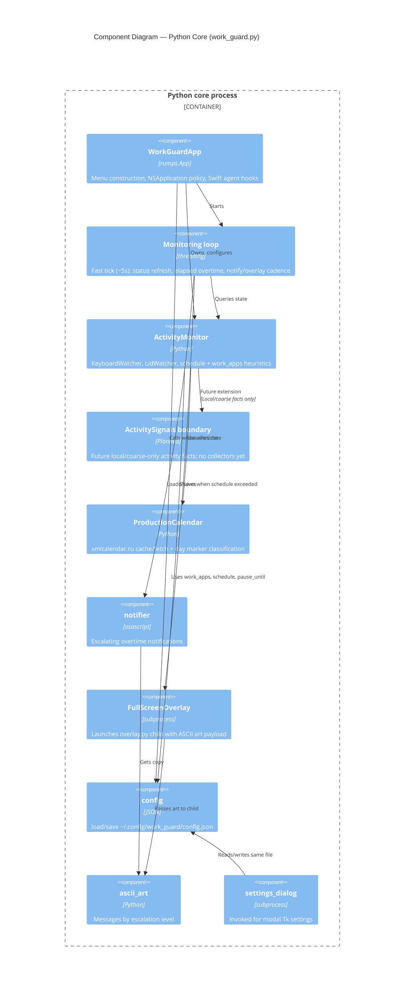

# WorkGuard — core components (C4 Level 3)

This diagram zooms into the **Python core process** and its main collaborating modules. It is intended for developers changing monitoring rules, UI wiring, or escalation behavior.

## Diagram

## Module map (codebase)

| Component | Source files |
|-----------|----------------|
| **WorkGuardApp** | `work_guard.py` (`WorkGuardApp`, menu handlers, Swift IPC) |
| **Monitoring loop** | `work_guard.py` (`_monitoring_loop`, elapsed overtime state) |
| **ActivityMonitor** | `monitor.py` (`ActivityMonitor`, `KeyboardWatcher`, `LidWatcher`) |
| **ActivitySignals boundary** | Planned docs-only boundary; no source file or collectors yet |
| **ProductionCalendar** | `production_calendar.py` |
| **notifier** | `notifier.py` |
| **FullScreenOverlay** | `overlay.py` (`FullScreenOverlay`, `_run_overlay`) |
| **config** | `config.py` |
| **ascii_art** | `ascii_art.py` |
| **settings_dialog** | `settings_dialog.py` (also runnable as `__main__`) |

The **Swift menu agent** (`WorkGuardMenu/main.swift`) is not inside this boundary; it exchanges data via `status.json` and `command.json` as documented in the dynamic diagram.

Future ActivitySignals must preserve the privacy boundary from the context view:
local/coarse-only facts, no raw activity history, no outbound transfer without
explicit user request, and no secret export under any request path.
