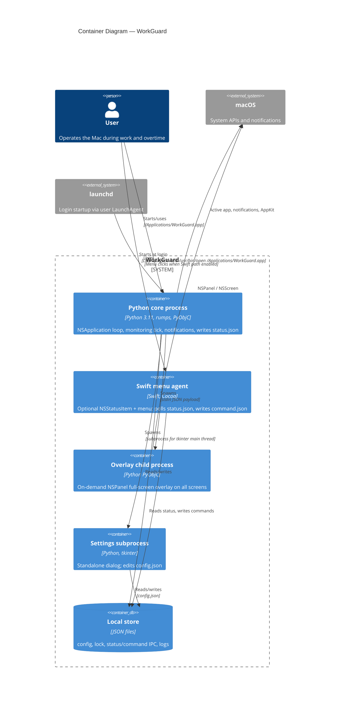

# WorkGuard — containers (C4 Level 2, Current)

Current contract: the only supported GUI target is `/Applications/WorkGuard.app`.
Direct Python launch exists only for debug/diagnostics.
Optional components run as separate OS processes for UI threading and isolation.

## Diagram

## Container responsibilities

| Container | Technology | Responsibility |
|-----------|------------|----------------|
| **Python core process** | `rumps`, PyObjC, `pynput`, threads | Single-instance lock, `ActivityMonitor` loop every ~5s, elapsed overtime accounting, overtime escalation (`notifier`, `FullScreenOverlay`), optional Swift agent lifecycle, `status.json` updates. |
| **Swift menu agent** | Cocoa `NSStatusBar` | When enabled (`workguard-menu` binary present), shows menu from `status.json`; user actions produce `command.json` for the Python core to poll. |
| **Overlay child process** | Same Conda `python`, `overlay.py` `__main__` | Separate process so `NSApplication` main thread rules are satisfied; shows blocking overlay with dismiss timer. |
| **Settings subprocess** | `tkinter` | Modal settings window in its own process to avoid threading issues with Tk on macOS. |
| **Local store** | Files under `~/.config/work_guard/` | `config.json` (`current_period_settings`, `pending_period_settings`, `deferral`, `calendar_source`, `calendar_cache_days`), `work_guard.lock`, `work_guard.log`, `calendar_ru_<year>.json`, `status.json` / `command.json` for Swift IPC. Overlay/lock/notification constants live in `work_guard.py`, not config. |

## Deployment notes

- **Supported launch target:** `/Applications/WorkGuard.app`.
- **Public entrypoint:** `bash rebuild.sh`.
- **Login startup contract:** `~/Library/LaunchAgents/com.agaibadulin.workguard.plist` runs `/usr/bin/open /Applications/WorkGuard.app` with `RunAtLoad=true` and `KeepAlive=false`.
- **Optional Swift agent:** `WorkGuardMenu/workguard-menu`; toggled with `WORKGUARD_SWIFT_MENU` and presence of the binary.
- **Not a supported target:** project-local `.app`.
