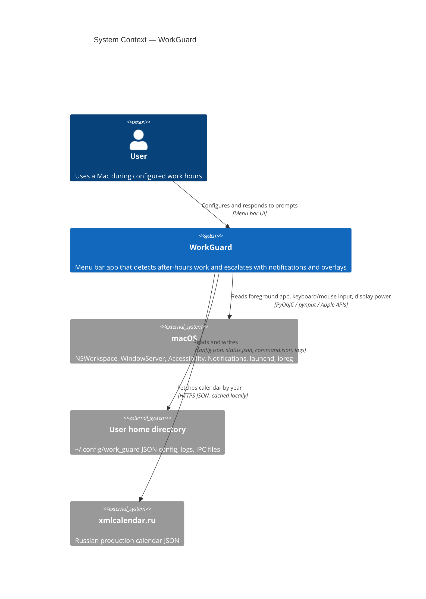

# WorkGuard — system context (C4 Level 1)

WorkGuard is a **local macOS menu bar utility** that helps a user stay within configured working hours. Runtime state and control stay on the machine; the production-calendar feature can fetch Russian calendar data from `xmlcalendar.ru` and then uses a local cache.

## Scope

- **In scope:** activity heuristics (keyboard/mouse input, foreground app, laptop lid), schedule settings, the overtime deferral ladder (20→10→5), user notifications, and a full-screen overlay when overtime is detected.
- **Planned boundary:** `ActivitySignals` may later add local, coarse-grained system/browser/app activity facts.
- **Out of scope:** cloud sync, multi-user accounts, employer telemetry, raw activity history collection, and outbound telemetry.

## Diagram

## External dependencies

| Actor / system | Role |
|----------------|------|
| **User** | Sets work schedule, defers overtime via the ladder, and responds to notifications/overlay. |
| **macOS** | Supplies active application name, notification surface (`osascript`), display/lid hints via `ioreg`, optional login startup via `launchd`, and requires **Accessibility** for keyboard monitoring. |
| **Local files** | Persistence under `~/.config/work_guard/` (see container view). |
| **xmlcalendar.ru** | Optional external calendar source; failures fall back to fresh/stale cache or configured weekdays. |

## Trust boundaries

- Primary trust boundary is local OS permissions and files under the user account.
- Calendar refresh crosses a network boundary to `xmlcalendar.ru`; fetched data is cached as `calendar_ru_<year>.json`.
- ActivitySignals are a future local-only boundary: WorkGuard may consume coarse facts, not raw URLs, clicks, typed text, or event streams.
- Nothing leaves the machine without an explicit user request; secrets never leave the machine.
