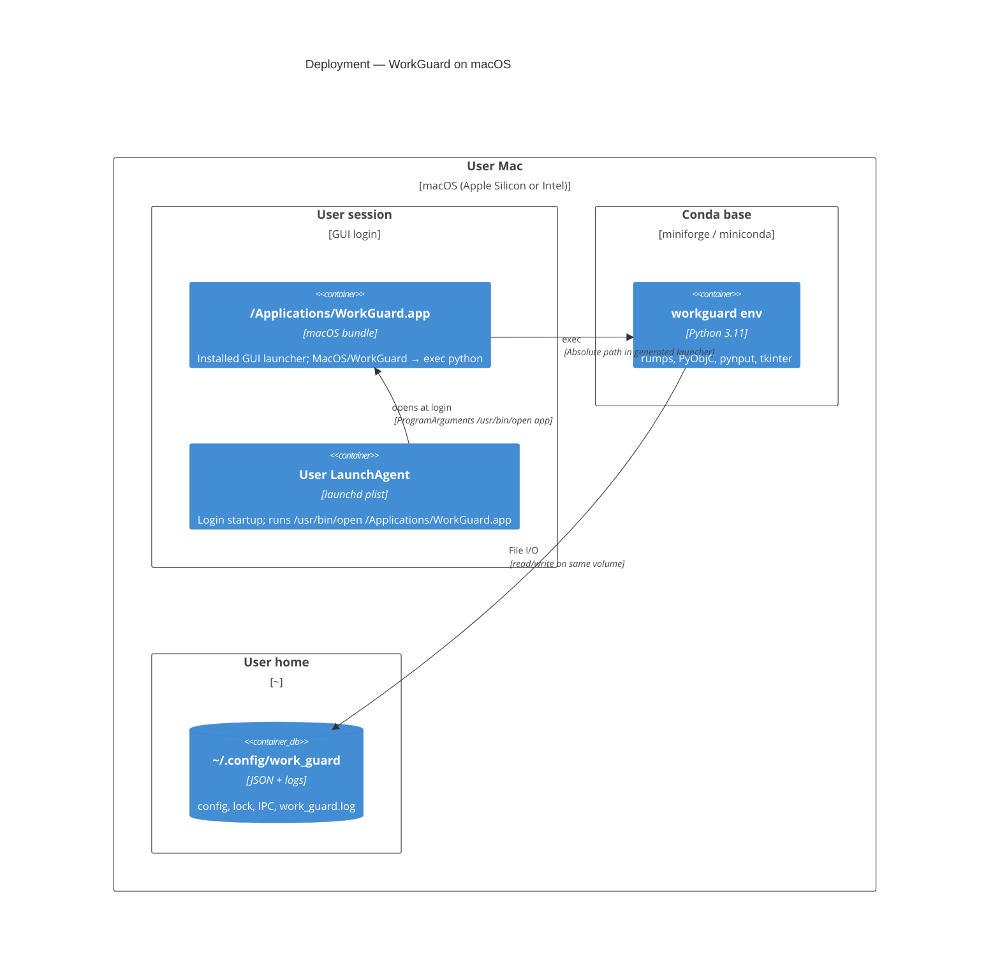

# WorkGuard — deployment view (C4 Level 4, Current)

WorkGuard is desktop-only: one user session, one machine, no server tier.
Current contract centers on the installed app at `/Applications/WorkGuard.app`.

## Diagram

## Build and run paths

- **Public entrypoint:** `bash rebuild.sh`.
- **Run:** user opens `/Applications/WorkGuard.app`.
- **Login startup:** `~/Library/LaunchAgents/com.agaibadulin.workguard.plist` runs `/usr/bin/open /Applications/WorkGuard.app` with `RunAtLoad=true` and `KeepAlive=false`.
- **Packaging assets:** bundle templates live under `packaging/` and are not runnable targets.
- **Bundle identity:** `CFBundleIdentifier=com.agaibadulin.workguard` for the installed app.
- **Debug only:** `conda run -n workguard python3 work_guard.py`.
- **Single instance:** `~/.config/work_guard/work_guard.lock` (fcntl) prevents duplicate Python cores.

## Not shown

- **CI/CD or app notarization** — not part of the current repository flow; distribution is local build.
- **Project-local `.app`** — not part of the supported launch contract.
