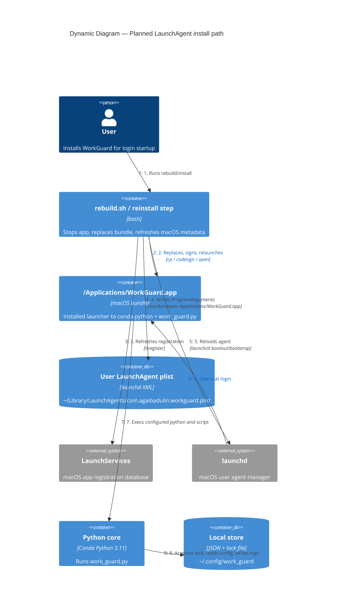

# WorkGuard — dynamic view: planned LaunchAgent install

Status: Planned.

This view captures the contract for `install-workguard-applications-launchagent`. The intended rebuild/install flow should behave like the other desktop service installers: replace the installed app bundle, refresh macOS launch metadata, update login startup, and relaunch the app. The installed `.app` remains a launcher to the configured Conda Python and project `work_guard.py`; it is not a standalone bundled Python app.

## Diagram

## Planned contract

| Concern | Direction |
|---------|-----------|
| Launch target | LaunchAgent runs `/usr/bin/open /Applications/WorkGuard.app`; the app launcher then execs Conda `python3 work_guard.py`. |
| Manual launch | `/Applications/WorkGuard.app` becomes the supported GUI target; direct terminal launch remains for debugging. |
| Bundle freshness | Reinstall stops WorkGuard, replaces `/Applications/WorkGuard.app`, refreshes LaunchServices, signs/registers, and relaunches. |
| Duplicate protection | Existing `fcntl` lock remains authoritative across installed app launches and direct debug launches. Project-local `.app` is not a supported launch target. |
| Stop/uninstall | `scripts/stop_workguard.sh` must remain compatible with `com.agaibadulin.workguard.plist` and the installed app path. |
| Ownership | Per-user only: `~/Library/LaunchAgents` and `gui/<uid>`, no system daemon. |

## Open questions before implementation

- Exact LaunchServices refresh command sequence and failure handling.
- Resolved: bundle templates and install-time assets live under `packaging/`.
