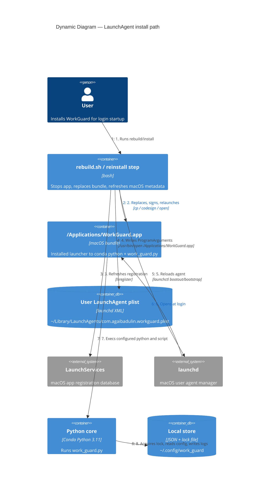

# WorkGuard — dynamic view: LaunchAgent install

Status: Current.

This view captures the current contract implemented by the archived
`install-workguard-applications-launchagent` change. The rebuild/install flow
replaces the installed app bundle, refreshes macOS launch metadata, updates login
startup, and relaunches the app. The installed `.app` remains a launcher to the
configured Conda Python and project `work_guard.py`; it is not a standalone
bundled Python app.

## Diagram

## Current contract

| Concern | Direction |
|---------|-----------|
| Launch target | LaunchAgent runs `/usr/bin/open /Applications/WorkGuard.app`; the app launcher then execs Conda `python3 work_guard.py`. |
| Manual launch | `/Applications/WorkGuard.app` is the supported GUI target; direct terminal launch remains for debugging. |
| Bundle freshness | Reinstall stops WorkGuard, replaces `/Applications/WorkGuard.app`, refreshes LaunchServices, signs/registers, and relaunches. |
| Duplicate protection | Existing `fcntl` lock remains authoritative across installed app launches and direct debug launches. Project-local `.app` is not a supported launch target. |
| Stop/uninstall | `scripts/stop_workguard.sh` must remain compatible with `com.agaibadulin.workguard.plist` and the installed app path. |
| Ownership | Per-user only: `~/Library/LaunchAgents` and `gui/<uid>`, no system daemon. |

## Resolved implementation details

- LaunchServices refresh uses app unregister/register rather than a global
  database kill.
- Bundle templates and install-time assets live under `packaging/`.
- `setup.sh` is obsolete and exits with a hard error pointing to `bash
  rebuild.sh`.
