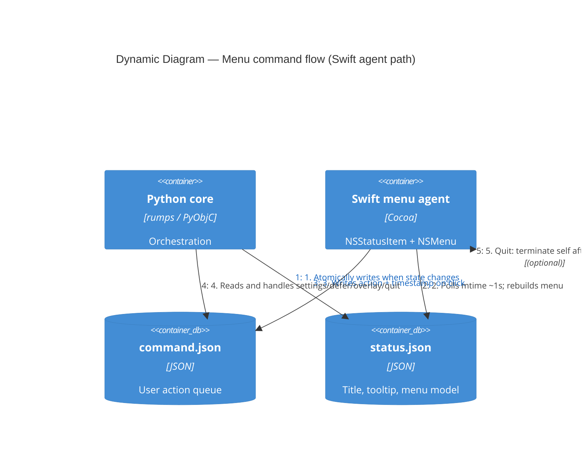

# WorkGuard — dynamic view: Swift menu ↔ Python core

When the **Swift menu agent** is enabled, the Python core does not own the only `NSStatusItem`. Instead, Python publishes menu state to disk; Swift renders the menu and writes user intentions back. Python polls `command.json` and maps actions to handlers.

## Diagram

## Action IDs

Written by Swift into `command.json` under `"action"` (handled in `WorkGuardApp._handle_swift_command`):

| Action | Effect |
|--------|--------|
| `settings` | Open settings dialog |
| `defer` | Consume next deferral ladder step (`defer_step()`) |
| `test_overlay` | Show test overlay |
| `quit` | Graceful shutdown |

Legacy `pause` / `resume` actions are defensively ignored — the pause feature was removed; older Swift binaries may still emit them.

Read-only display rows (`status`, `overtime`) are ignored as commands.

## Deferral button payload

`status.json` carries a `defer_button: {title, enabled}` object that drives the single
contextual menu item. Python computes it from deferral state via `_contextual_button_state()`:

| State | title | enabled |
|-------|-------|---------|
| Outside overtime | `Работаем!` | `false` |
| Cutoff window or ladder exhausted | `пора отдыхать` | `false` |
| Step unlock delay active | `Отложить на N мин` | `false` |
| Ladder step available | `Отложить на {20\|10\|5} мин` | `true` |

Swift renders the item from `defer_button`; if the field is missing it omits the item
(no crash). Click writes `command.json {"action": "defer", "ts": ...}`.
